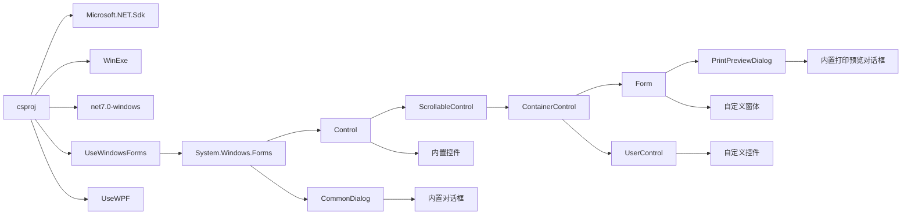

# 实例

```mermaid
graph LR
csproj-->Microsoft.NET.Sdk
csproj-->WinExe
csproj-->net7.0-windows
csproj-->UseWindowsForms-->System.Windows.Forms-->Control-->ScrollableControl-->ContainerControl-->Form-->PrintPreviewDialog-->内置打印预览对话框
Form-->自定义窗体
ContainerControl-->UserControl-->自定义控件
Control-->内置控件
System.Windows.Forms-->CommonDialog-->内置对话框
csproj-->UseWPF
```