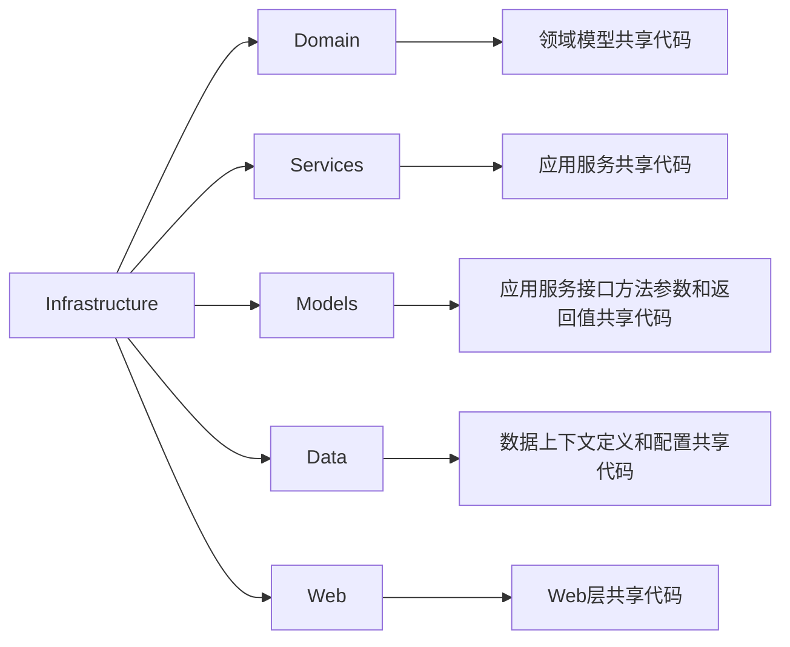
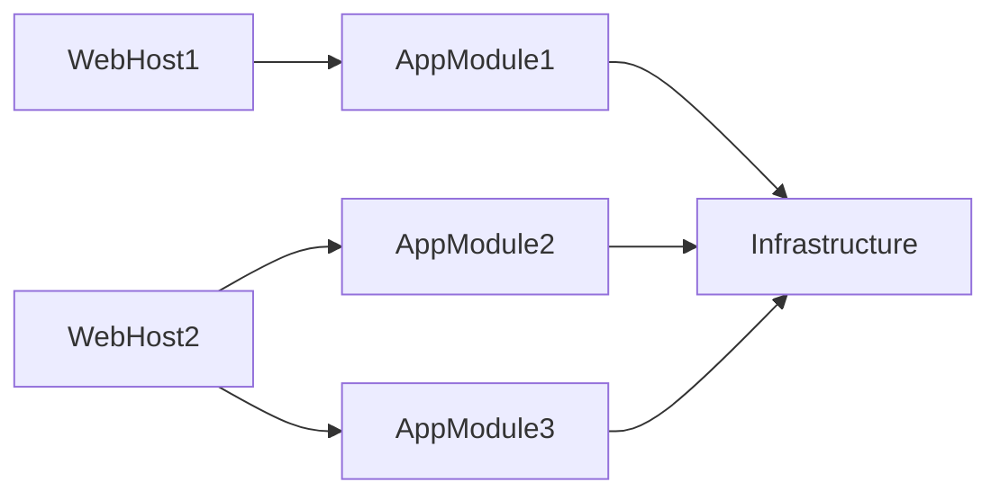
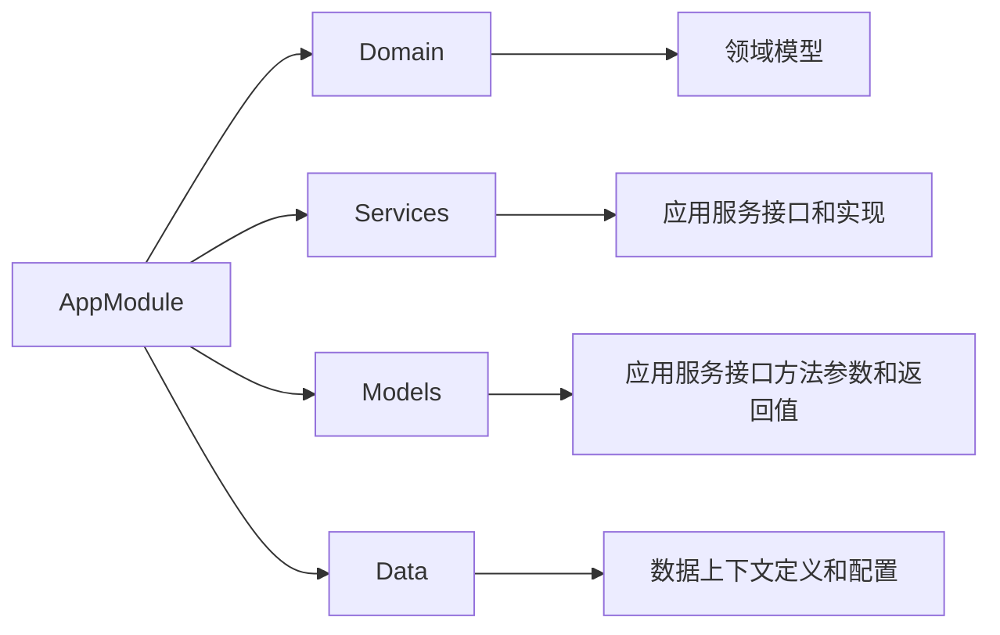
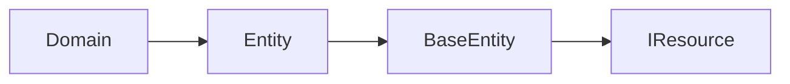
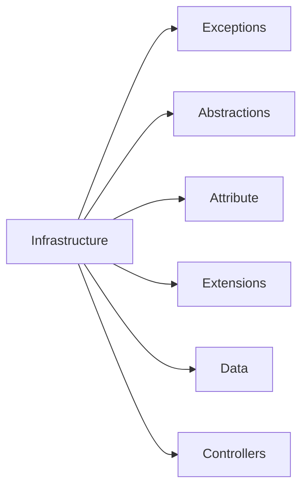
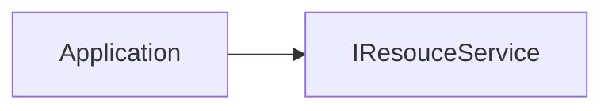

# WTA: Web template for asp.net

1. 开发环境
    1. Windows 11
    1. Git & TortoiseGit 
    1. Visual Studio 2022
    1. Docker Desktop
1. 调试
    1. 克隆源码
    1. 配置依赖
        1. docker compose 启动 MinIO、MySQL、Redis
        1. 自定义 appSettings.Development.json 访问本地或容器内运行的依赖
    1. Migrations 项目执行 `dotnet ef database update`
    1. 调试启动 Web 项目
1. 推送代码
    1. 修改
        1. 前后端代码修改、配置文件修改、数据库迁移修改、文档修改
        1. 文档修改使用 markdown 和 mermaid
        1. 实体变动在 Migrations 项目中添加迁移，提交后需要在测试服务器数据库上执行迁移
    1. 本地提交
    1. 拉取并变基 `git pull --rebase`
    1. 解决冲突并推送

## 服务决策：

Service 自动转换为 Controller 方式不可取，既增加了启动时间又无法解决两者返回值的不兼容问题，Service 方法的返回值通常只是 Action 的一种。

Controller 作为 Service 是可取的，通过自定义 Exception和 ActionFilter，可以解决返回值兼容问题

1. 统一返回值格式：不使用 ActionResult，通过返回 CustomApiResponse\<T\> 统一 API 返回格式
1. 避免多种返回类型：通过 throw 自定义 Exception（BadRequestException 和 ProblemException）方式自动处理输入异常和服务端异常
1. 避免手动 try catch：通过自定义 CustomActionFilter 处理自动或手动抛出的异常，转换为 CustomApiResponse\<T\> 格式

## 模块化决策

程序集作为模块不可取，多个简单模块可以定义在一个程序集中

1. 模块为业务模块而非技术模块，模块之间不应该有技术依赖
1. 模块化不耦合程序集，通过继承 BaseModule 定义逻辑模块
1. 数据上下文关联模块，实体和配置关联数据上下文
1. 初始化数据库时，通过模块和实体的关系生成权限分类和权限

## API决策

1. BaseController 基类添加 ApiControllerAttribute，省略 Action 参数添加 FromBodyAttribute
1. 路由默认配置为：api/[controller]/[action]，省略 Controller 添加 RouteAttribute
1. Action 默认添加 HttpMethod 为 Post
1. GroupName 为空时默认为 Controller 所在程序集

## 解决方案和项目

1. 使用 Markdown 格式文档
1. [使用 .gitattributes 定义行末规则](https://docs.github.com/en/get-started/getting-started-with-git/configuring-git-to-handle-line-endings)
1. [使用 .gitignore 忽略无需上传的文件](https://docs.github.com/en/get-started/getting-started-with-git/ignoring-files)
1. [使用Nuget.config 配置程序包源](https://learn.microsoft.com/zh-cn/nuget/reference/nuget-config-file)
1. [使用 Directory.Packages.props 或 Directory.Build.props 集中管理 NuGet 程序包版本](https://learn.microsoft.com/zh-cn/nuget/consume-packages/central-package-management)

## 基础设施项目解构



## 项目依赖关系

WebHost 根据引用的项目不同承载不同的 AppModule



AppModule 组织



### 领域层

1. 类库项目
1. 不引用其他任何项目
1. 定义领域模型：实体、聚合根、值对象
1. 实体类实现为 POCO



### 基础设施层

1. 引用领域层
1. 实现领域层接口



### 应用层

1. 引用领域层和基础设施层
1. 配置领域层接口和基础设施层实现
1. 定义应用服务接口和实现




## 后端

### 实体和模型

实体字段引用类型采用可空引用类型，值类型采用可空值类型，使用IsRequired控制数据库是否可空

```sehll
# https://learn.microsoft.com/zh-cn/ef/core/cli/dotnet
dotnet tool update --global dotnet-ef
dotnet add package Microsoft.EntityFrameworkCore.Design
dotnet ef migrations add init -c DefaultDbContext
```
