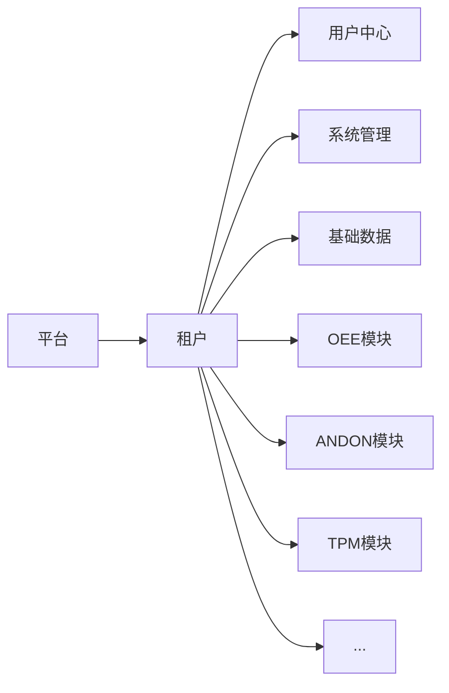
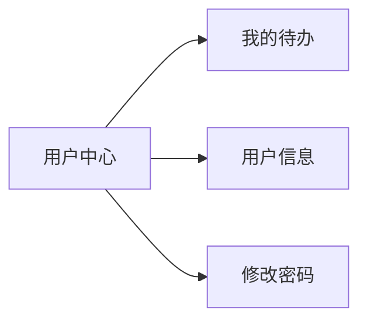
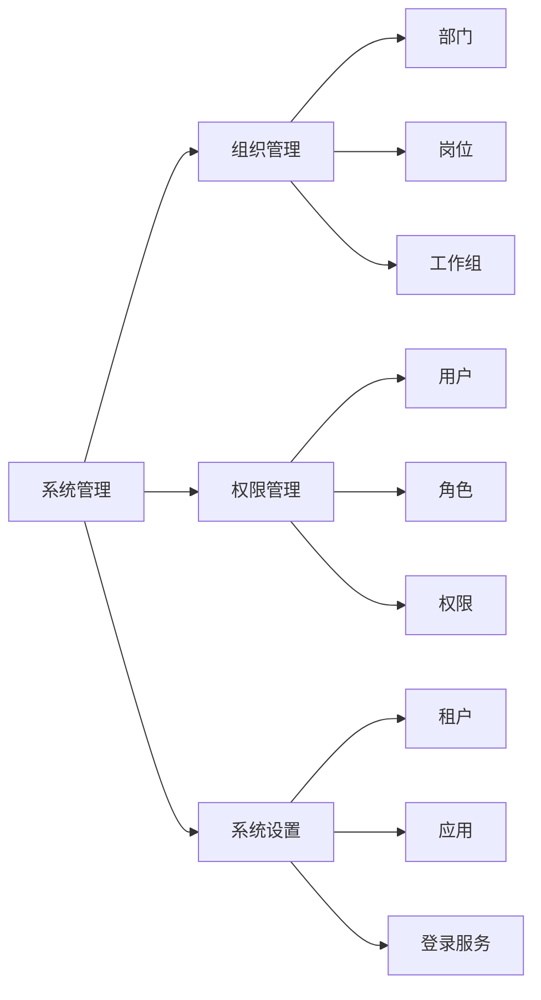

# 帮助中心

```mermaid
flowchart LR
平台-->租户-->用户中心
租户-->系统管理
租户-->基础数据
租户-->OEE模块
租户-->ANDON模块
租户-->TPM模块
租户-->...
```

## 用户中心

```mermaid
flowchart LR
用户中心-->我的待办
用户中心-->用户信息
用户中心-->修改密码
```

## 系统管理

```mermaid
flowchart LR
系统管理-->组织管理
组织管理-->部门
组织管理-->岗位
组织管理-->工作组
系统管理-->权限管理
权限管理-->用户
权限管理-->角色
权限管理-->权限
系统管理-->系统设置
系统设置-->租户
系统设置-->应用
系统设置-->登录服务
```
