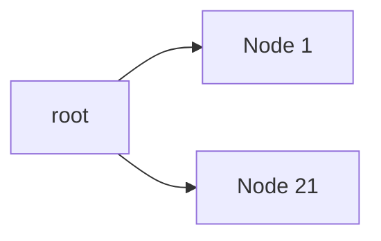
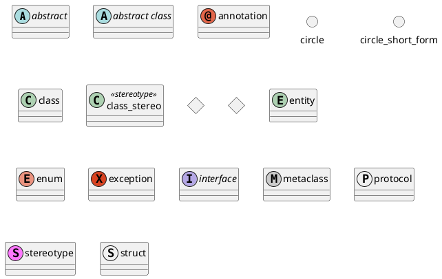

# 帮助中心

文档格式为 Markdown ，使用 Cherry Markdown 解析

配置
<https://github.com/Tencent/cherry-markdown/wiki/%E9%85%8D%E7%BD%AE%E9%A1%B9%E5%85%A8%E8%A7%A3>

样例
<https://tencent.github.io/cherry-markdown/examples/index.html>

## 自动目录

`[[toc]]`
[[toc]]

## 待办

- [ ] AAA
- [x] BBB
- [ ] CCC
  - [ ] DDD

## 代码块语法高亮

```javascript
import { createApp, ref } from 'vue'

createApp({
  setup() {
    return {
      count: ref(0)
    }
  }
}).mount('#app')
```

## MathJax 公式

行内公式： $e=mc^2$

块级公式：$$
\begin{aligned}
P(B|A)&=\frac{P(AB)}{P(A)}\\
P(\overline{B}|A)&=1-P(B|A)=1-\frac{P(AB)}{P(A)}
\end{aligned}
$$

## Echarts 图表

| :line:{x,y} | Header1 | Header2 | Header3 | Header4 |
| ------ | ------ | ------ | ------ | ------ |
| Sample1 | 11 | 11 | 4 | 33 |
| Sample2 | 112 | 111 | 22 | 222 |
| Sample3 | 333 | 142 | 311 | 11 |

## Mermaid 图表

<https://mermaid.nodejs.cn>



## PlantUML 图表

<https://plantuml.com/zh/sitemap-language-specification>


