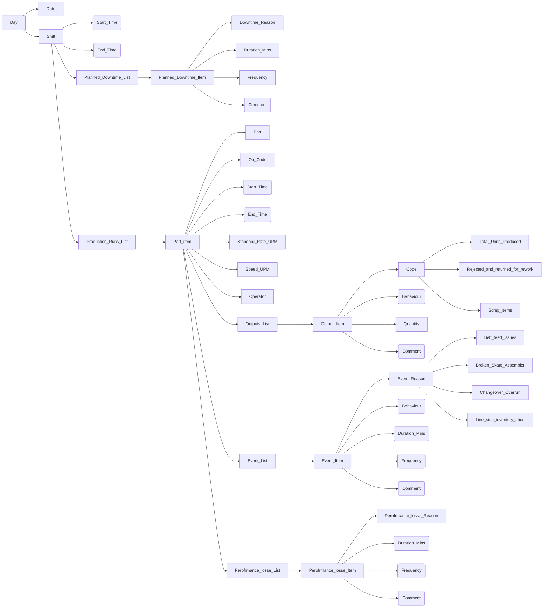
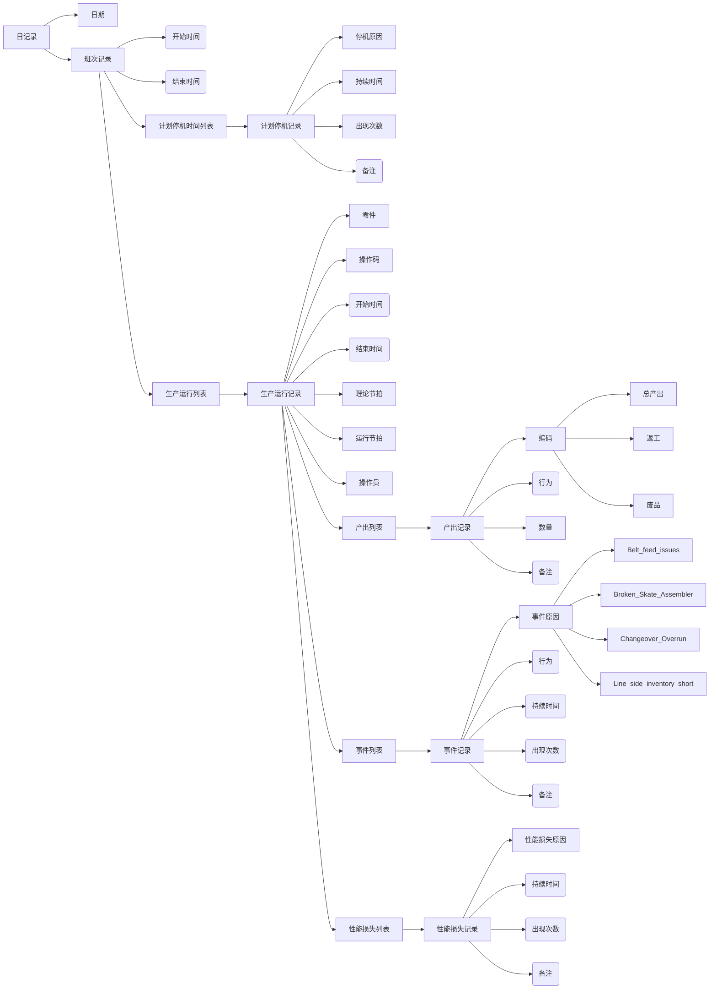

# Gemba

## Shift Editor

## 班次编辑

## OEE数据格式分析

<table>
<tr>
<td>日期</td>
<td>班次</td>
<td>开始时间</td>
<td>结束时间</td>
<td>班次持续时间</td>
<td>类型</td>
<td>原因</td>
</tr>
<tr>
<td>-</td>
<td>-</td>
<td>-</td>
<td>-</td>
<td>-</td>
<td>计划停机</td>
<td>停机原因</td>
</tr>
<tr>
<td>-</td>
<td>-</td>
<td>-</td>
<td>-</td>
<td>-</td>
<td>生产运行</td>
</tr>
</table>
