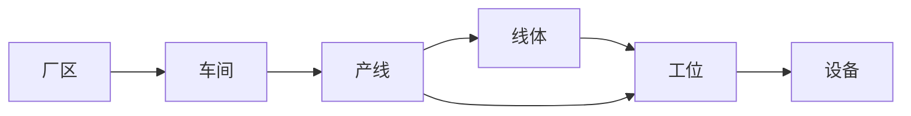
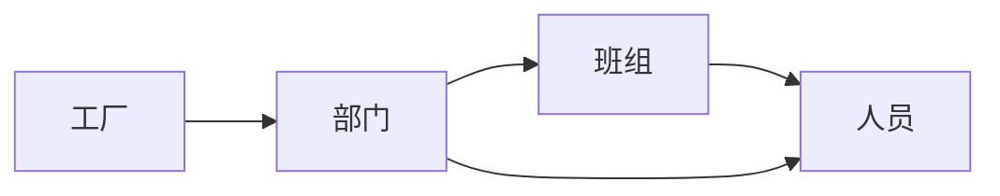
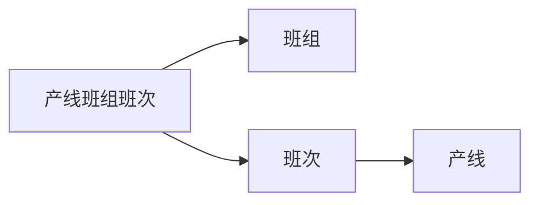
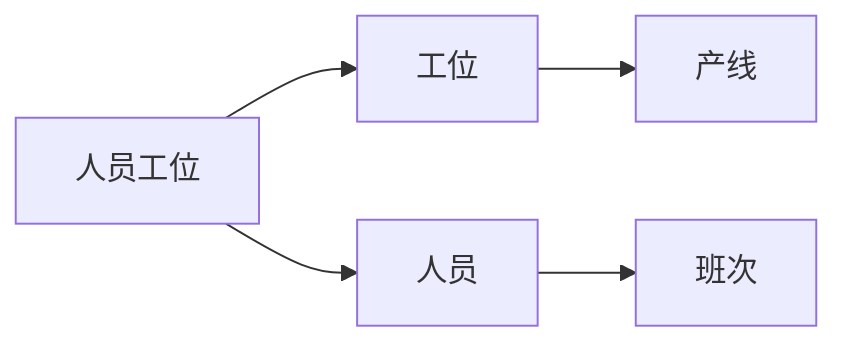
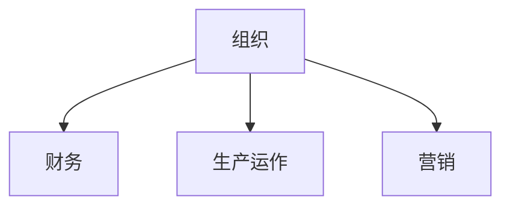
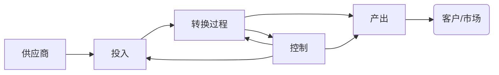
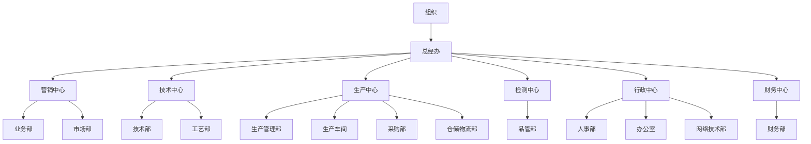
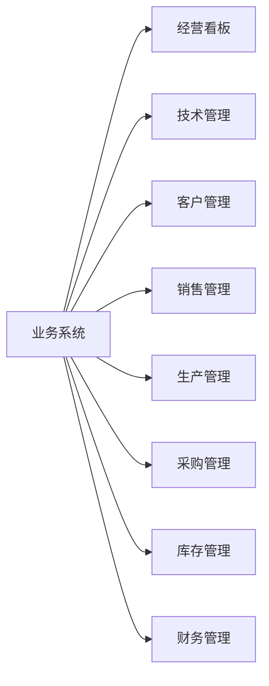
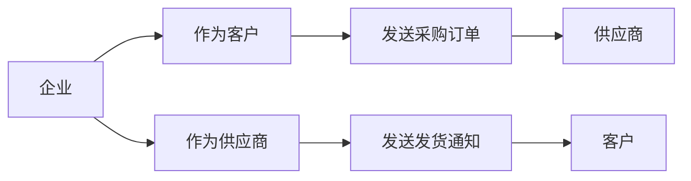
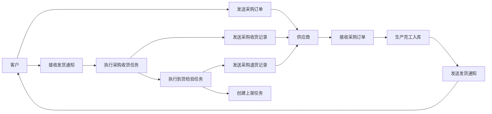

# 基础数据

## 工位

```mermaid
flowchart LR
厂区-->车间-->产线-->线体-->工位-->设备
产线-->工位
```

## 人员

```mermaid
flowchart LR
工厂-->部门-->班组-->人员
部门-->人员
```

## 产线班组班次

```mermaid
flowchart LR
产线班组班次-->班组
产线班组班次-->班次-->产线
```

## 人员工位

```mermaid
flowchart LR
人员工位-->工位-->产线
人员工位-->人员-->班次
```

## 组织机构

### 基本职能

```mermaid
flowchart TD

组织-->财务
组织-->生产运作
组织-->营销
```

### 生产与运作系统

```mermaid
flowchart LR

供应商-->投入-->转换过程-->产出-->客户(客户/市场)
转换过程-->控制
控制-->转换过程
控制-->投入
控制-->产出
```

### 组织机构模型

```mermaid
flowchart TD

组织-->总经办
总经办-->营销中心
营销中心-->业务部
营销中心-->市场部

总经办-->技术中心
技术中心-->技术部
技术中心-->工艺部
总经办-->生产中心
生产中心-->生产管理部
生产中心-->生产车间
生产中心-->采购部
生产中心-->仓储物流部

总经办-->检测中心
检测中心-->品管部

总经办-->行政中心
行政中心-->人事部
行政中心-->办公室
行政中心-->网络技术部

总经办-->财务中心
财务中心-->财务部
```

### 业务系统

```mermaid
flowchart LR

业务系统-->经营看板
业务系统-->技术管理
业务系统-->客户管理
业务系统-->销售管理
业务系统-->生产管理
业务系统-->采购管理
业务系统-->库存管理
业务系统-->财务管理
```

## EDI

```mermaid
flowchart LR

  企业-->作为客户-->发送采购订单-->供应商
  企业-->作为供应商-->发送发货通知-->客户
```

```mermaid
flowchart LR

  客户-->发送采购订单-->供应商
  供应商-->接收采购订单-->生产完工入库-->发送发货通知-->客户
  客户-->接收发货通知-->执行采购收货任务-->发送采购收货记录-->供应商
执行采购收货任务-->执行到货检验任务-->发送采购退货记录-->供应商
执行到货检验任务-->创建上架任务
```
