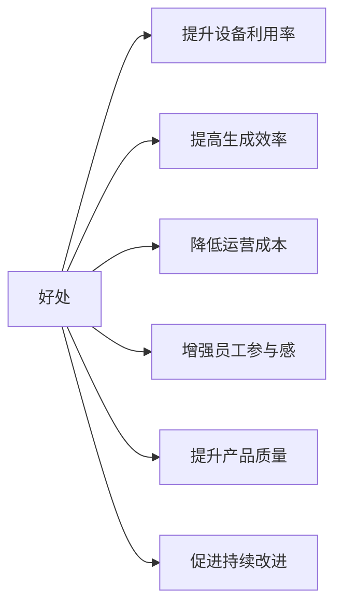
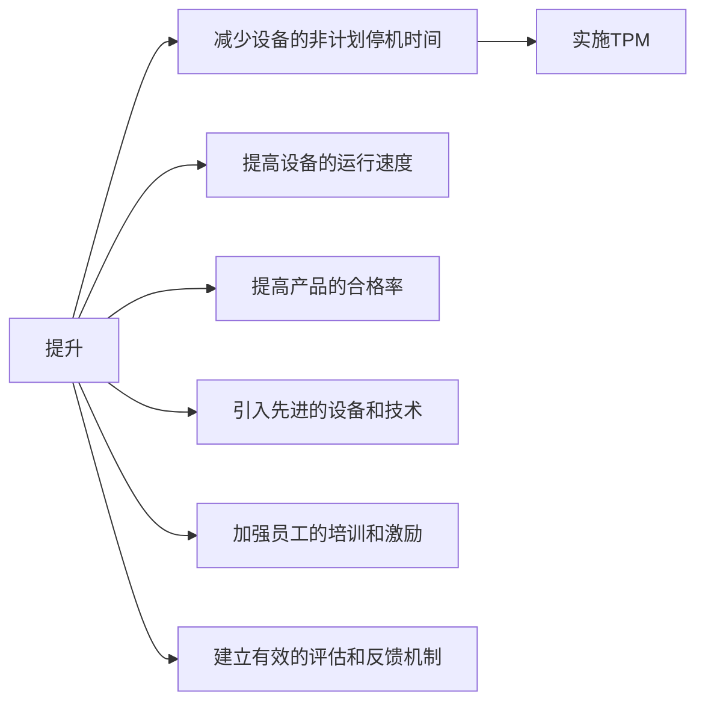

# MES

## OEE

<https://www.ibm.com/cn-zh/topics/oee>

1. OEE = Overall Equipment Effectiveness = 综合设备效率
1. Availability：可用性、时间稼动率、时间利用率
1. Performance：性能、性能稼动率、生产效率
1. Quality：质量、良品率、产品合格率

### 计算方法

OEE = $ Availability*Performance*Quality $

Avaliability = $ \frac{实际运行时间}{计划运行时间} $

Performance = $ \frac{实际产量}{理论最大产量} $

Quality = $ \frac{实合格产品数}{总产品数} $

### 好处

### 如何提升

### 改进算法

OEE = 时间开动率 × 性能开动率 × 合格品率

#### 时间开动率

时间开动率= 开动时间 / 负荷时间

负荷时间 = 日历工作时间 - 计划停机时间
负荷时间 = 日历工作时间 - 计划停机时间 - 设备外部因素停机时间

开动时间 = 负荷时间 - 故障停机时间 -安装、调整和初始化停机时间

#### 性能开动率

性能开动率 = 加工数量 × 实际加工周期 / 开动时间

## TEEP 设备综合生产力

<https://www.ibm.com/cn-zh/topics/teep>

TEEP = 时间负荷率 x OEE

时间负荷率 = 计划工作时间/日历时间
