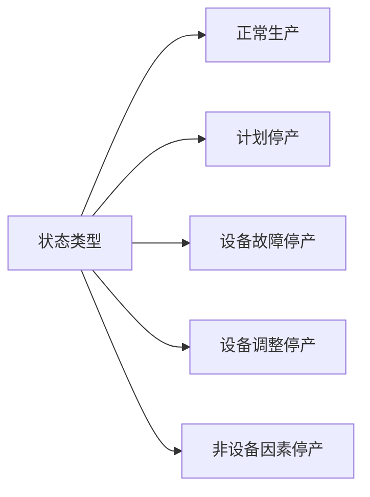
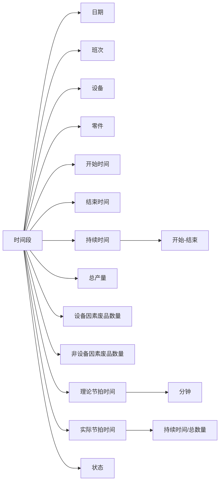

# OEE

<https://www.ibm.com/cn-zh/topics/oee>

设备综合效率/Overall Equipment Effectiveness
$$可用性\times 性能\times 质量$$

## 状态

## 数据记录

## 计算公式

1. 可用性:
   $$\frac {生产时间} {生产时间 + 停产时间}$$
2. 性能:
   $$\frac{理论节拍时间\times总产量}{生产时间}$$
3. 质量:
   $$\frac{总产量 - 废品数量}{总产量}$$

## 改进版公式

1. 可用性:
   $$\frac {生产时间} {生产时间 + 停产时间 - 非设备因素停产}$$
2. 性能:
   $$\frac{理论节拍时间\times总产量}{生产时间}$$
3. 质量:
   $$\frac{总产量 - 设备因素废品数量 - 非设备因素废品数量}{总产量 - 非设备因素废品数量}$$
