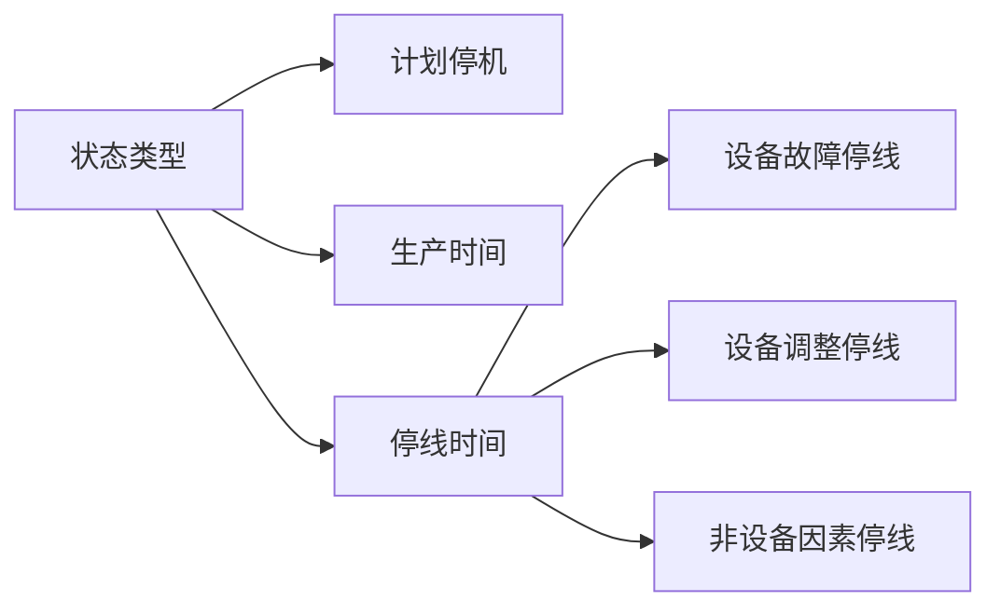
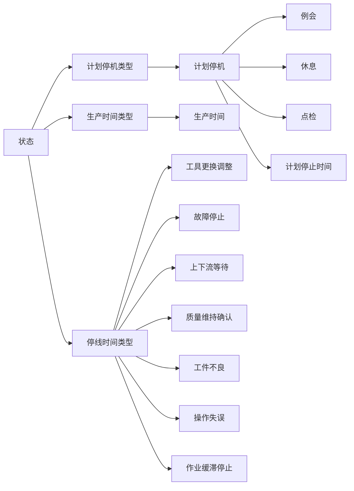
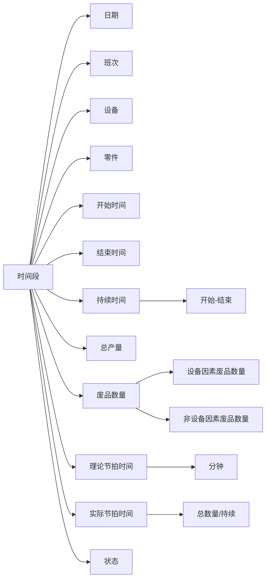

# OEE

设备综合效率:Overall Equipment Effectiveness

## 状态

## 数据

## 计算

1. 可用性:
   $$\frac {生产时间} {生产时间 + 停线时间}$$
2. 性能:
   $$\frac{理论节拍时间\times总产量}{生产时间}$$
3. 质量:
   $$\frac{总产量 - 废品数量}{总产量}$$
4. 设备综合效率
   $$可用性\times 性能\times 质量 = \frac {生产时间} {生产时间 + 停线时间} \times \frac{理论节拍时间\times总产量}{生产时间} \times \frac{总产量 - 废品数量}{总产量} = \frac{理论节拍时间\times(总产量 - 废品数量)}{生产时间 + 停线时间}$$

## 修正版

1. 可用性:
   $$\frac {生产时间 - 非设备因素停线} {生产时间 + 停线时间}$$
2. 性能:
   $$\frac{理论节拍时间\times总产量}{生产时间}$$
3. 质量:
   $$\frac{总产量 - 设备因素废品数量 - 非设备因素废品数量}{总产量 - 非设备因素废品数量}$$
4. 设备综合效率
   $$可用性\times 性能\times 质量 = \frac {生产时间 - 非设备因素停线} {生产时间 + 停线时间} \times \frac{理论节拍时间\times总产量}{生产时间} \times \frac{总产量 - 设备因素废品数量 - 非设备因素废品数量}{总产量 - 非设备因素废品数量} = \frac{理论节拍时间\times(总产量 - 废品数量)}{生产时间 + 停线时间}$$
