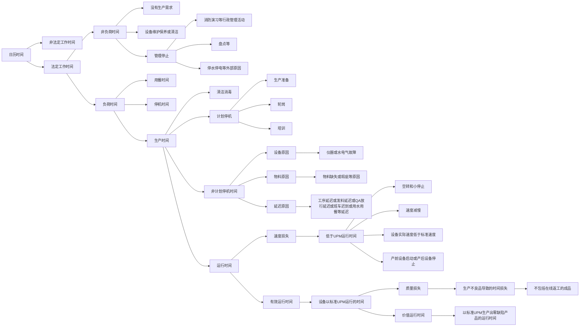

# OEE2

<https://wenku.baidu.com/view/74193a2bbdd5b9f3f90f76c66137ee06eff94e7f.html?_wkts_=1732166159581&bdQuery=OEE+UPM>

## 标准UPM

1. 设备在理想状态下每分钟的产量
1. 合理值
   1. 设备PQ的UPM
   1. 设备达到并可维持的最好UPM
   1. 依据类似设备经验的估计值(如业界标准)
1. UPM由IE小组进行更新和维护

## OEE单个产品的计算公式

$$\frac {运行时间} {生产时间} \times \frac{实际产出/UPM}{运行时间} \times \frac{实际产出 - 不良品数量}{实际产出}$$

=

$$\frac{(实际产出 - 不良品数量)/UPM}{实际产出}$$

=

$$\frac{合格产品数量/UPM}{实际产出}$$

## OEE多个产品的计算公式

## OEE 班次计算公式

## OEE 工单计算公式

## OEE 工作中心计算公式

## OEE 区域计算公式

整体进行求和运算

$$\frac{\sum(A_i合格产品数量/A_iUPM)}{\sum A_i实际产出}$$
