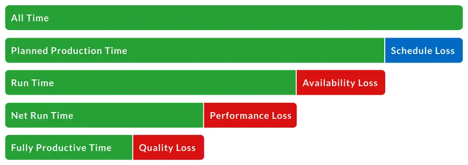
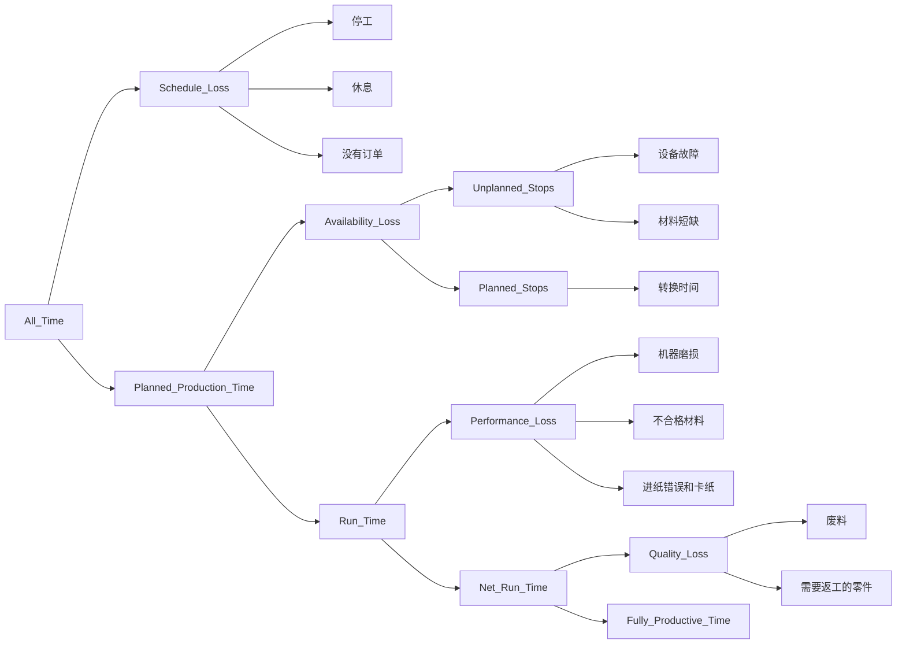

# OEE

<https://www.oee.com/>

1. Overall Equipment Effectiveness: 设备全局效率
1. Availability: 可用性
1. Performance: 性能
1. Quality: 质量

$$OEE=AE \times PE \times QE$$

## OEE 因素

```mermaid
flowchart LR

All_Time-->Schedule_Loss
All_Time-->Planned_Production_Time
Planned_Production_Time-->Availability_Loss
Planned_Production_Time-->Run_Time
Run_Time-->Performance_Loss
Run_Time-->Net_Run_Time
Net_Run_Time-->Quality_Loss
Net_Run_Time-->Fully_Productive_Time

Schedule_Loss-->停工
Schedule_Loss-->休息
Schedule_Loss-->没有订单
Availability_Loss-->Unplanned_Stops-->设备故障
Unplanned_Stops-->材料短缺
Availability_Loss-->Planned_Stops-->转换时间
Performance_Loss-->机器磨损
Performance_Loss-->不合格材料
Performance_Loss-->进纸错误和卡纸
Quality_Loss-->废料
Quality_Loss-->需要返工的零件
```
