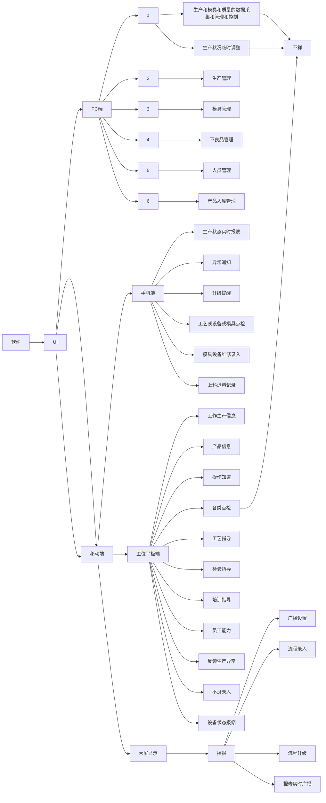

# ZT MES

```mermaid
flowchart LR
软件-->UI-->PC端-->1-->生产和模具和质量的数据采集和管理和控制-->不祥
1-->生产状况临时调整-->不祥
PC端-->2-->生产管理
PC端-->3-->模具管理
PC端-->4-->不良品管理
PC端-->5-->人员管理
PC端-->6-->产品入库管理
UI-->移动端-->手机端-->生产状态实时报表
手机端-->异常通知
手机端-->升级提醒
手机端-->工艺或设备或模具点检
手机端-->模具设备维修录入
手机端-->上料退料记录
UI-->移动端-->工位平板端-->工作生产信息
工位平板端-->产品信息
工位平板端-->操作知道
工位平板端-->各类点检-->不祥
工位平板端-->工艺指导
工位平板端-->检验指导
工位平板端-->培训指导
工位平板端-->员工能力
工位平板端-->反馈生产异常
工位平板端-->不良录入
工位平板端-->设备状态报修
移动端-->大屏显示-->播报-->广播设置
播报-->流程录入
播报-->流程升级
播报-->报修实时广播
```
