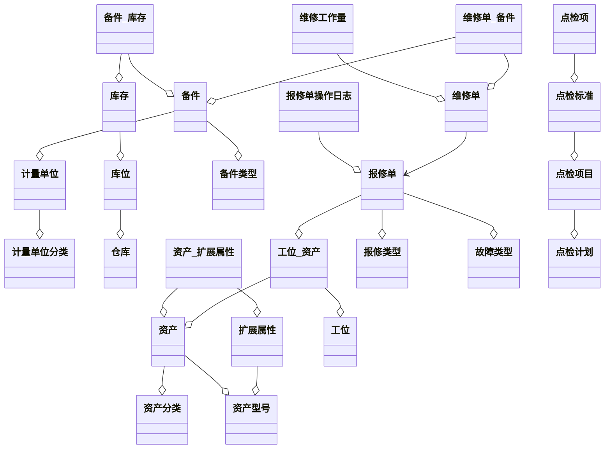
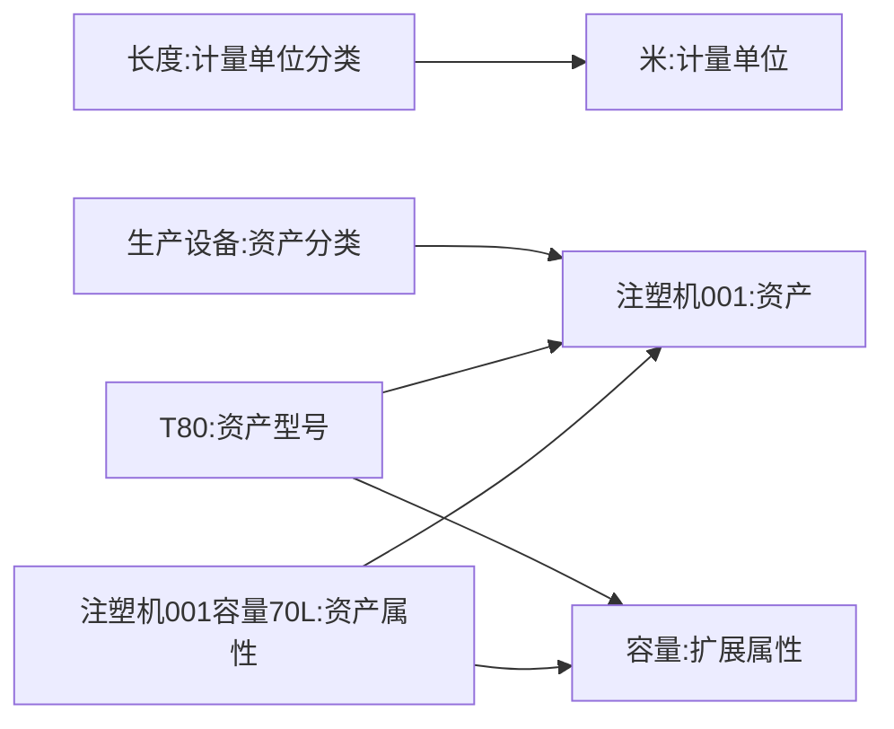

# TPM

## 类图

```mermaid
classDiagram
计量单位--o计量单位分类
库位--o仓库
库存--o库位
备件--o计量单位
备件--o备件类型
备件_库存--o备件
备件_库存--o库存
资产--o资产分类
资产--o资产型号
扩展属性--o资产型号
资产_扩展属性--o扩展属性
资产_扩展属性--o资产
工位_资产--o工位
工位_资产--o资产
报修单--o工位_资产
报修单--o报修类型
报修单--o故障类型
报修单操作日志--o报修单
维修单-->报修单
维修工作量--o维修单
维修单_备件--o维修单
维修单_备件--o备件
点检项--o点检标准
点检项目--o点检计划
点检标准--o点检项目
```

## 对象图

```mermaid
flowchart LR
长度:计量单位分类-->米:计量单位
生产设备:资产分类-->注塑机001:资产
T80:资产型号-->注塑机001:资产
T80:资产型号-->容量:扩展属性
注塑机001容量70L:资产属性-->容量:扩展属性
注塑机001容量70L:资产属性-->注塑机001:资产

```
