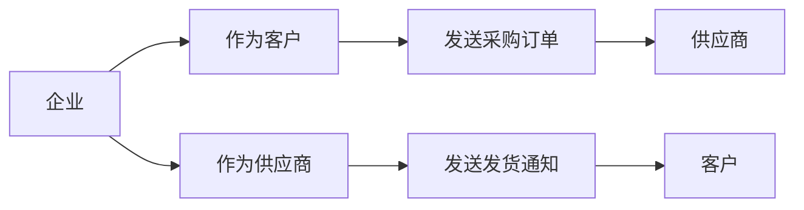
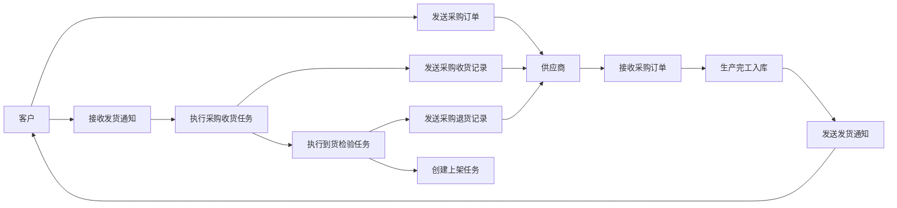

# 数据相关

## EDI

```mermaid
flowchart LR

  企业-->作为客户-->发送采购订单-->供应商
  企业-->作为供应商-->发送发货通知-->客户
```

```mermaid
flowchart LR

  客户-->发送采购订单-->供应商
  供应商-->接收采购订单-->生产完工入库-->发送发货通知-->客户
  客户-->接收发货通知-->执行采购收货任务-->发送采购收货记录-->供应商
执行采购收货任务-->执行到货检验任务-->发送采购退货记录-->供应商
执行到货检验任务-->创建上架任务
```
