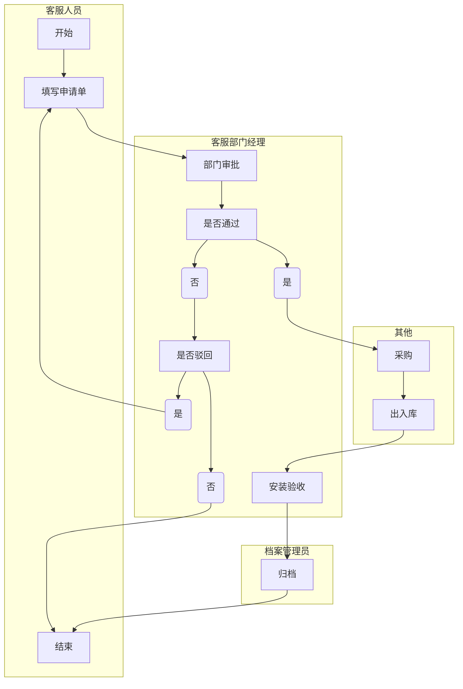

# 主要流程

```mermaid
flowchart TD

  subgraph 客服人员
  开始 --> 填写申请单
  结束
  end

  subgraph 客服部门经理
  部门审批 --> 是否通过
  是否通过 --> 通过(是)
  是否通过 --> 不通过(否)
  不通过 --> 是否驳回
  是否驳回 --> 未驳回(否)
  是否驳回 --> 驳回(是)
  安装验收
  end

  subgraph 档案管理员
  归档
  end

  subgraph 其他
  采购 --> 出入库
  end

  填写申请单 --> 部门审批
  驳回 --> 填写申请单
  未驳回(否) --> 结束
  通过(是) --> 采购
  出入库 --> 安装验收
  安装验收 --> 归档 --> 结束

```
