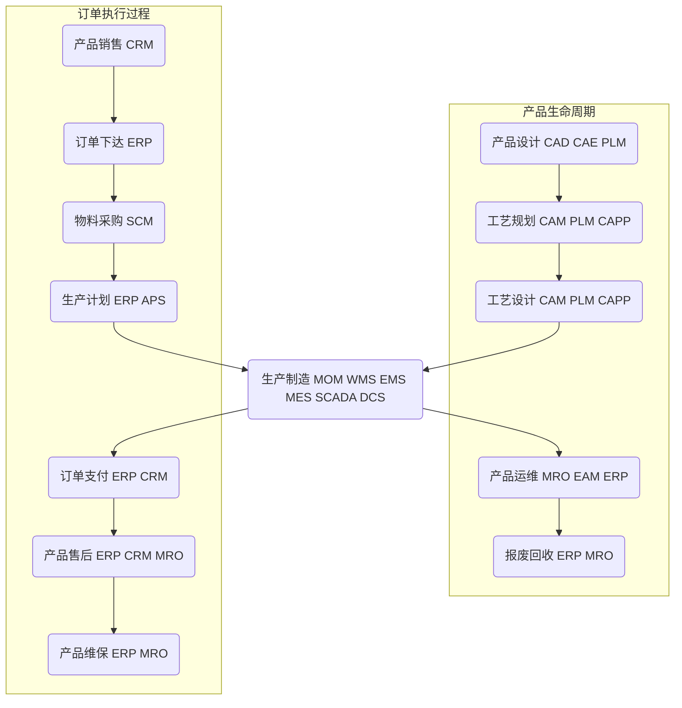

```mermaid
flowchart TD

  subgraph 产品生命周期
  产品设计(产品设计 CAD CAE PLM) --> 工艺规划(工艺规划 CAM PLM CAPP) --> 工艺设计(工艺设计 CAM PLM CAPP)
  产品运维(产品运维 MRO EAM ERP) --> 报废回收(报废回收 ERP MRO)
  end

  工艺设计 --> 生产制造(生产制造 MOM WMS EMS MES SCADA DCS) --> 产品运维

  生产计划 --> 生产制造(生产制造 MOM WMS EMS MES SCADA DCS) --> 订单支付

  subgraph 订单执行过程
  产品销售(产品销售 CRM) --> 订单下达(订单下达 ERP)--> 物料采购(物料采购 SCM) --> 生产计划(生产计划 ERP APS)
   订单支付(订单支付 ERP CRM) --> 产品售后(产品售后 ERP CRM MRO) --> 产品维保(产品维保 ERP MRO)
  end
```
