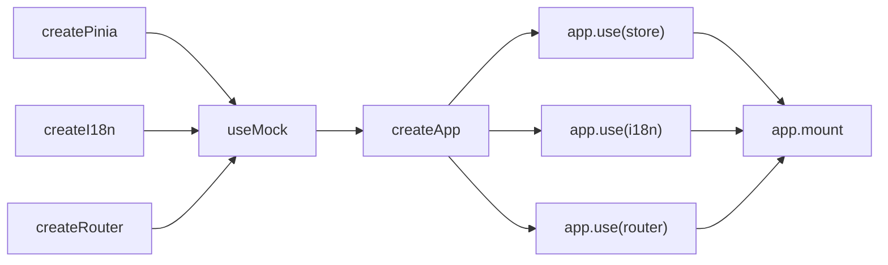

```mermaid
flowchart LR

createPinia --> useMock
createI18n --> useMock
createRouter --> useMock
useMock --> createApp
createApp --> store["app.use(store)"]  --> app.mount
createApp --> i18n["app.use(i18n)"] --> app.mount
createApp --> router["app.use(router)"] --> app.mount
```
