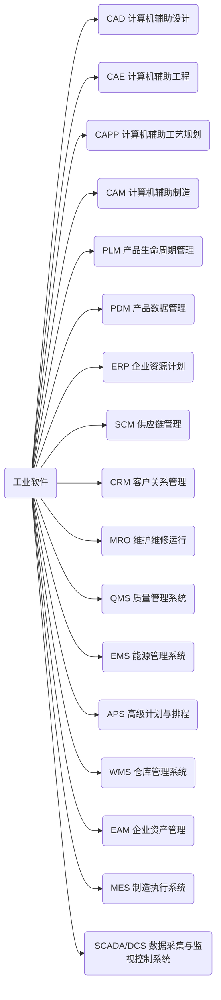

```mermaid
flowchart LR

  root(工业软件)
  root --> cad(CAD 计算机辅助设计) 
  root --> cae(CAE 计算机辅助工程)
  root --> capp(CAPP 计算机辅助工艺规划)
  root --> cam(CAM 计算机辅助制造)
  root --> plm(PLM 产品生命周期管理)
  root --> pdm(PDM 产品数据管理)
  root --> erp(ERP 企业资源计划)
  root --> scm(SCM 供应链管理)
  root --> crm(CRM 客户关系管理)
  root --> mro(MRO 维护维修运行)
  root --> qms(QMS 质量管理系统)
  root --> ems(EMS 能源管理系统)
  root --> aps(APS 高级计划与排程)
  root --> wms(WMS 仓库管理系统)
  root --> eam(EAM 企业资产管理)
  root --> mes(MES 制造执行系统)
  root --> scada(SCADA/DCS 数据采集与监视控制系统)
```
