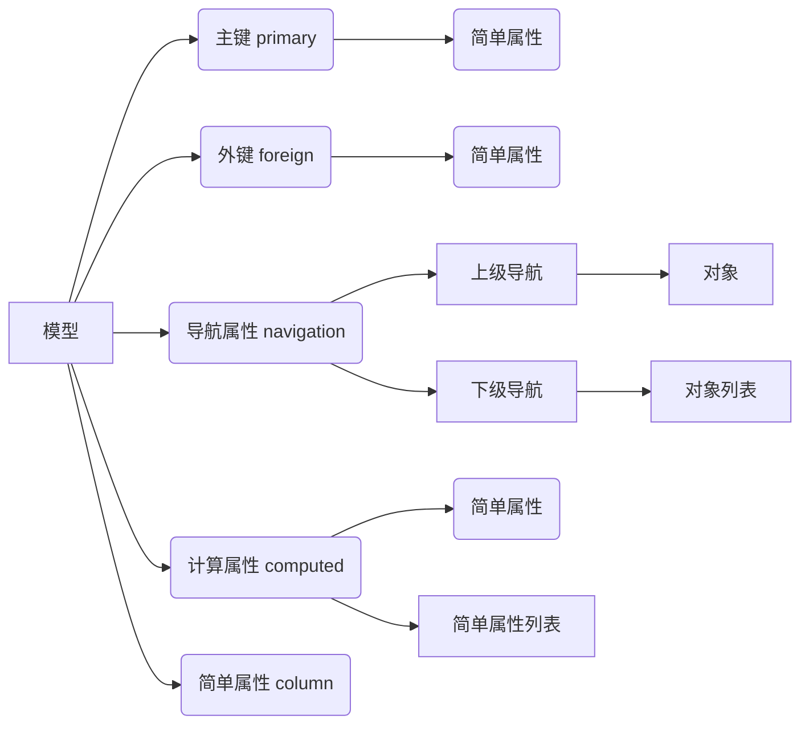
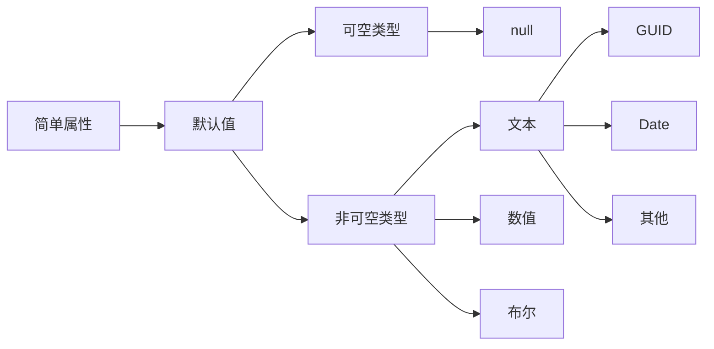

# 帮助

## 对象属性

导航属性前端不处理

```mermaid
flowchart LR

  模型 --> 主键(主键 primary) --> 简单属性1(简单属性)
  模型 --> 外键(外键 foreign) --> 简单属性2(简单属性)
  模型 --> 导航属性(导航属性 navigation)
  导航属性 --> 上级导航 --> 对象
  导航属性 --> 下级导航 --> 对象列表
  模型 --> 计算属性(计算属性 computed)
  计算属性 --> 简单属性3(简单属性)
  计算属性 --> 简单属性列表
  模型 --> 简单属性(简单属性 column)
```

## 简单属性

```mermaid
flowchart LR

  简单属性 --> 默认值
  默认值 --> 可空类型 --> null
  默认值 --> 非可空类型 --> 文本 --> GUID
  文本 --> Date
  文本 --> 其他
  非可空类型 --> 数值
  非可空类型 --> 布尔
```
