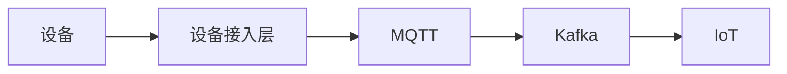
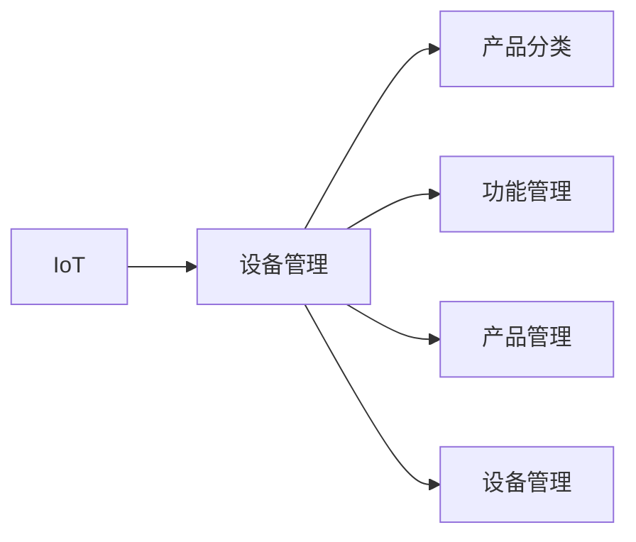
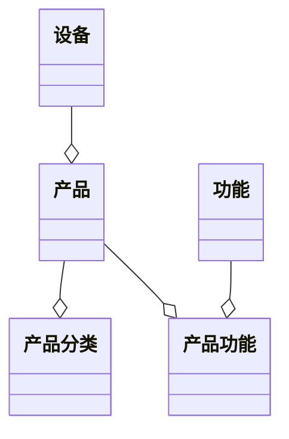
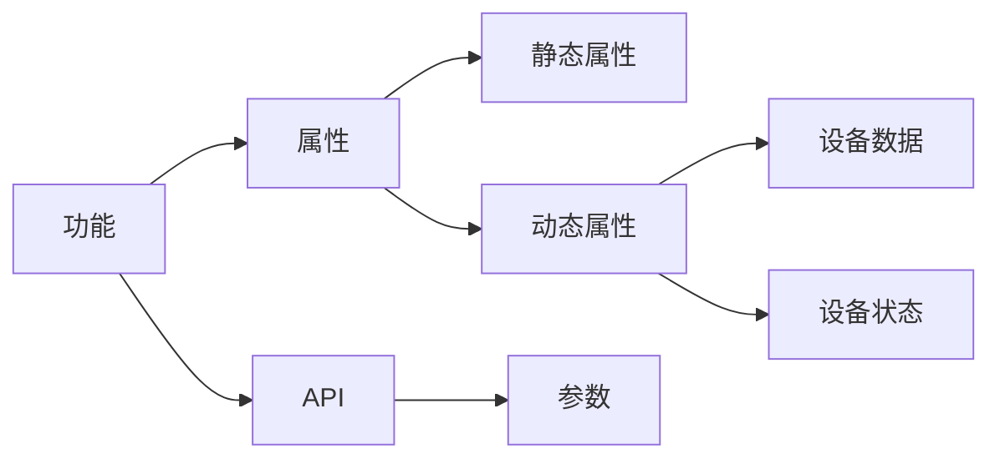
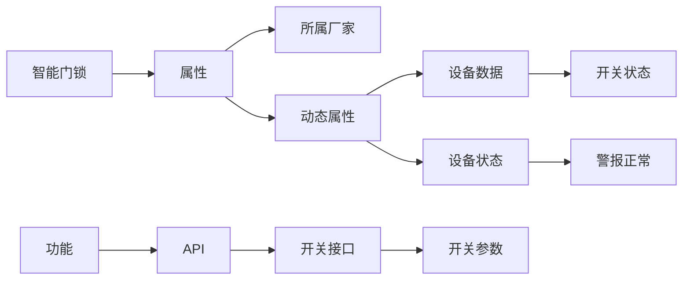

# IoT

数据以MQTT方式上报，MQTT主题发布到Kafka，应用从Kafka订阅设备的数据和事件

功能定义了设备的属性、事件和服务，一个产品关联多个功能，设备是产品的实例

命令定义了对设备的具体操作，即调用的服务和参数

场景是一组命令的集合，可以作为一组按钮提供给用户调用

定时器根据规则调用命令或场景

触发器定义了对设备属性或事件的响应，触发时调用命令或场景

## 数据上报

## 功能模块

## 类图

## 产品功能

