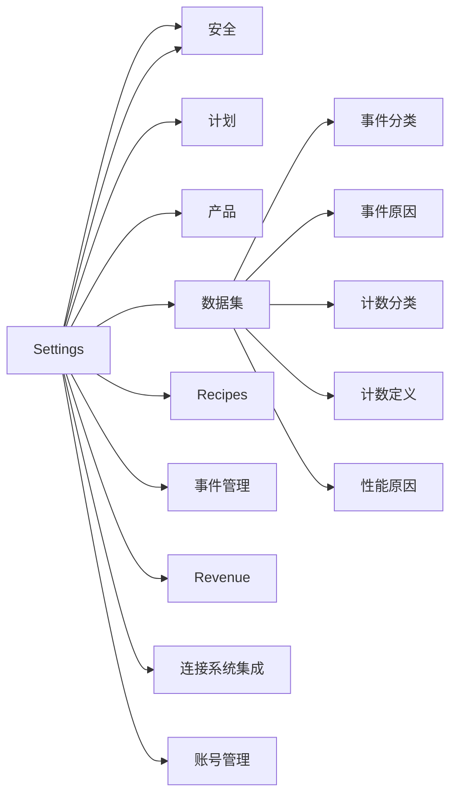
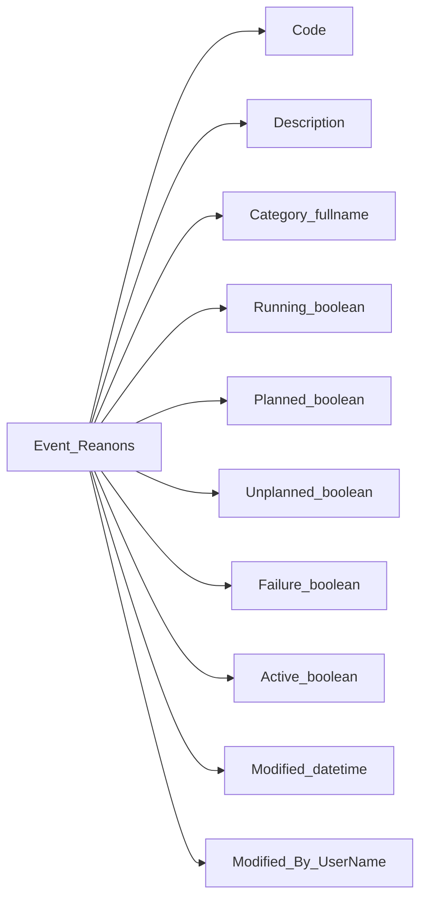
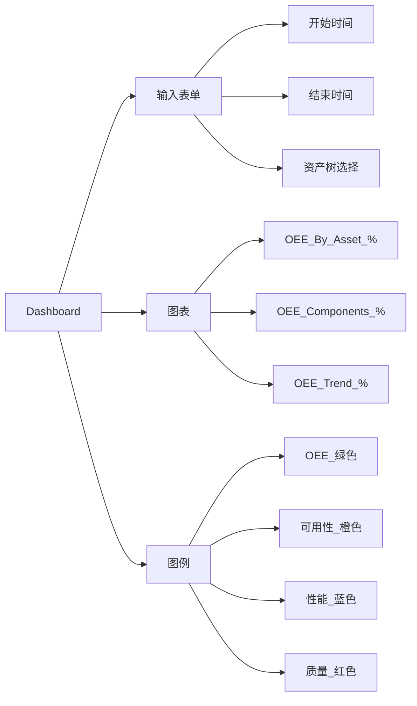
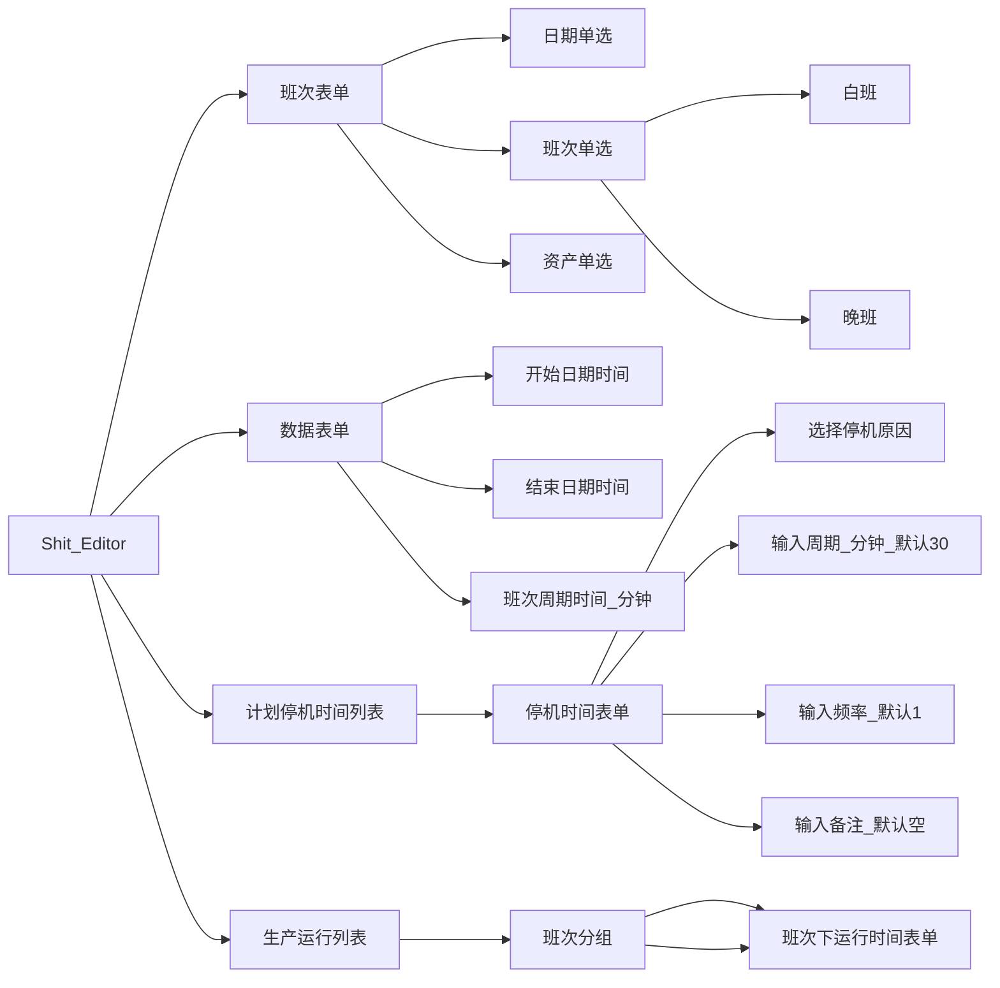

# Gemba Cloud

## 设置

```mermaid
flowchart LR
Settings-->安全
Settings-->计划
Settings-->产品
Settings-->数据集-->事件分类
数据集-->事件原因
数据集-->计数分类
数据集-->计数定义
数据集-->性能原因
Settings-->安全
Settings-->Recipes
Settings-->事件管理
Settings-->Revenue
Settings-->连接系统集成
Settings-->账号管理
```

### 事件原因

```mermaid
flowchart LR
Event_Reanons-->Code
Event_Reanons-->Description
Event_Reanons-->Category_fullname
Event_Reanons-->Running_boolean
Event_Reanons-->Planned_boolean
Event_Reanons-->Unplanned_boolean
Event_Reanons-->Failure_boolean
Event_Reanons-->Active_boolean
Event_Reanons-->Modified_datetime
Event_Reanons-->Modified_By_UserName
```

## 仪表盘

```mermaid
flowchart LR
Dashboard-->输入表单-->开始时间
输入表单-->结束时间
输入表单-->资产树选择
Dashboard-->图表-->OEE_By_Asset_%
图表-->OEE_Components_%
图表-->OEE_Trend_%
Dashboard-->图例-->OEE_绿色
图例-->可用性_橙色
图例-->性能_蓝色
图例-->质量_红色
```

## 班次编辑器

```mermaid
flowchart LR
Shit_Editor-->班次表单-->日期单选
班次表单-->班次单选
班次单选-->白班
班次单选-->晚班
班次表单-->资产单选
Shit_Editor-->数据表单-->开始日期时间
数据表单-->结束日期时间
数据表单-->班次周期时间_分钟
Shit_Editor-->计划停机时间列表-->停机时间表单-->选择停机原因
停机时间表单-->输入周期_分钟_默认30
停机时间表单-->输入频率_默认1
停机时间表单-->输入备注_默认空
Shit_Editor-->生产运行列表-->班次分组-->班次下运行时间表单
班次分组-->班次下运行时间表单
```