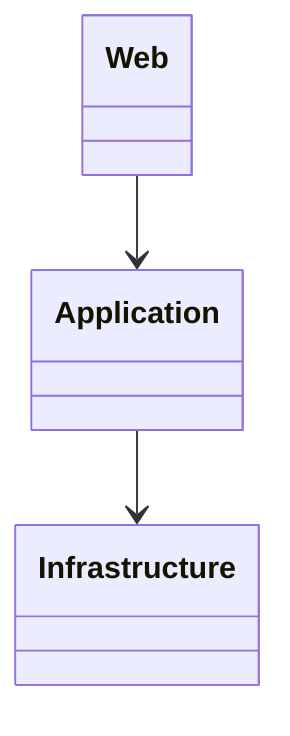
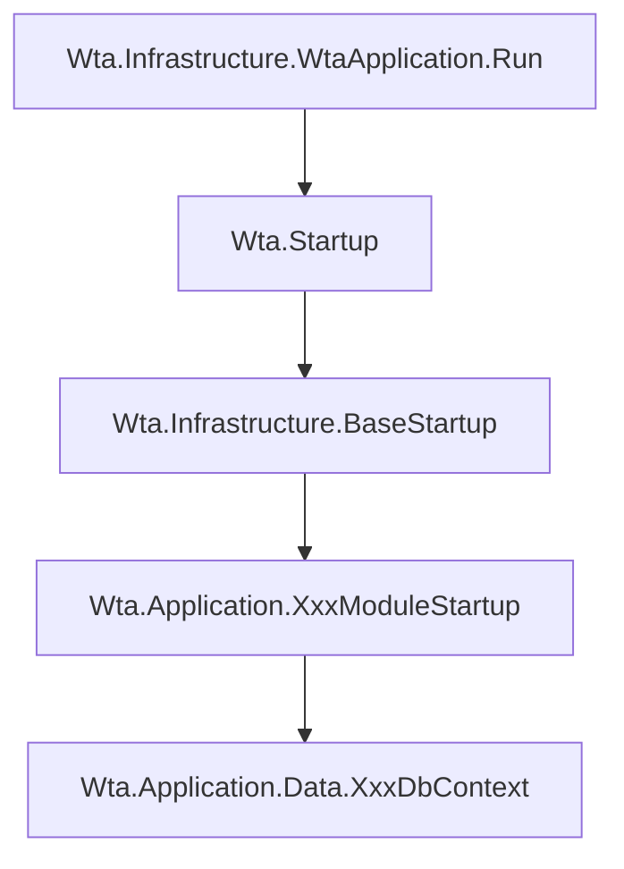

# 后端说明

核心是源码服用而非程序包复用

## 项目依赖 

## 模块化

每个模块通过接口依赖和扩展方法避免类继承依赖

1. 每个模块实现 IApplicationModule、IStartup、IDbContext 接口

1. Web 项目定义 Web.Startup 实现 BaseStartup
1. Web.Startup 中引用具体的 XxxModule
1. BaseStartup 根据引用的模块循环初始化依赖注入和应用配置

