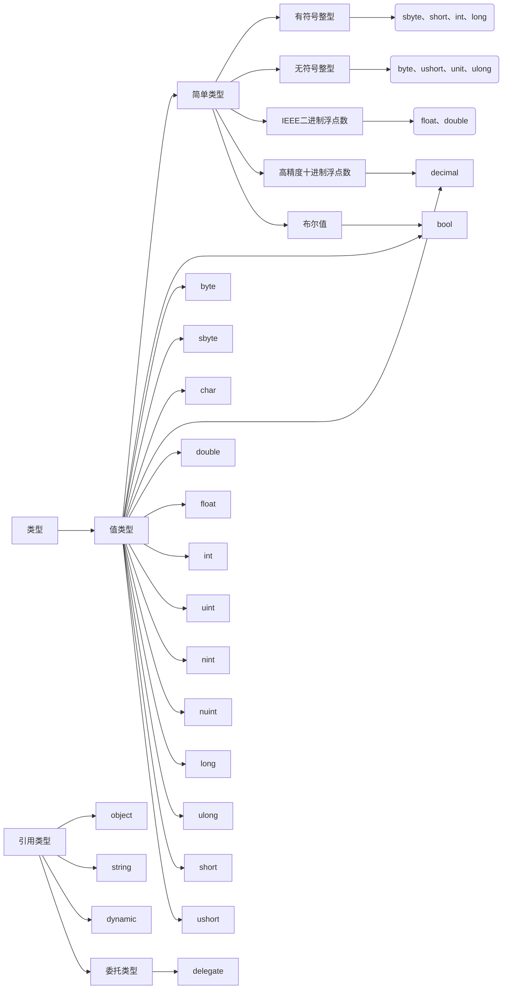
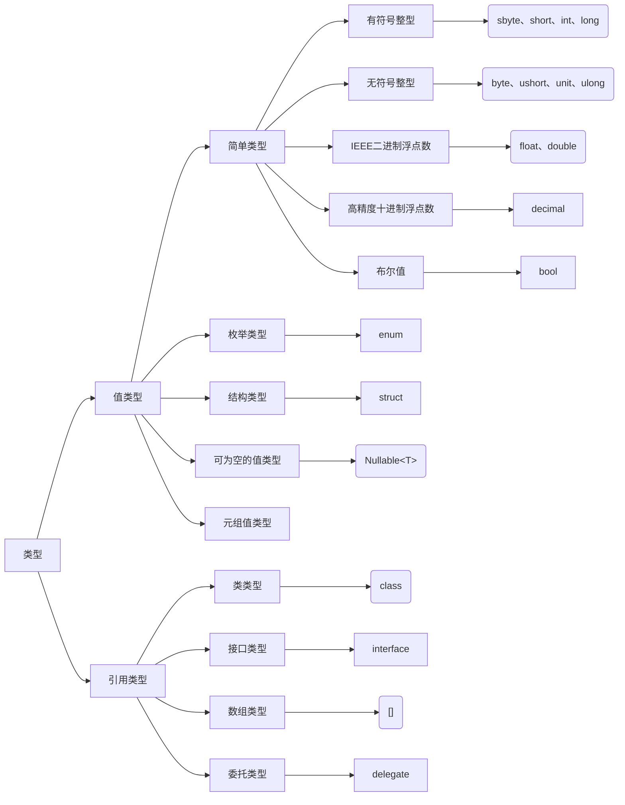
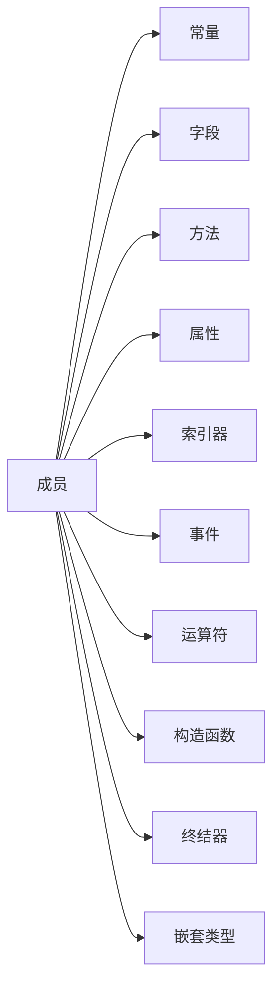
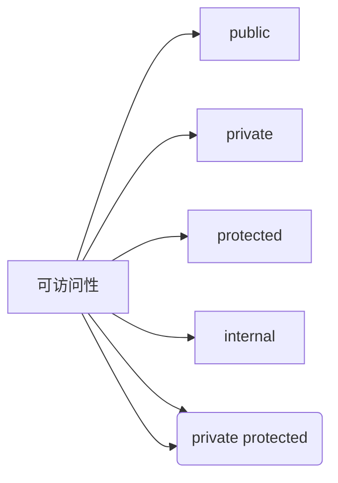

# C\#

## 类型

### 分类

```mermaid
graph LR
类型-->值类型
值类型-->简单类型
简单类型-->有符号整型-->v1(sbyte、short、int、long)
简单类型-->无符号整型-->v2(byte、ushort、unit、ulong)
简单类型-->IEEE二进制浮点数-->v3(float、double)
简单类型-->高精度十进制浮点数-->decimal
简单类型-->布尔值-->bool
值类型-->bool
值类型-->byte
值类型-->sbyte
值类型-->char
值类型-->decimal
值类型-->double
值类型-->float
值类型-->int
值类型-->uint
值类型-->nint
值类型-->nuint
值类型-->long
值类型-->ulong
值类型-->short
值类型-->ushort
引用类型-->object
引用类型-->string
引用类型-->dynamic
引用类型-->委托类型-->delegate
```

### 内置类型

```mermaid
graph LR
类型-->值类型
值类型-->简单类型
简单类型-->有符号整型-->v1(sbyte、short、int、long)
简单类型-->无符号整型-->v2(byte、ushort、unit、ulong)
简单类型-->IEEE二进制浮点数-->v3(float、double)
简单类型-->高精度十进制浮点数-->decimal
简单类型-->布尔值-->bool
值类型-->枚举类型-->enum
值类型-->结构类型-->struct
值类型-->可为空的值类型-->v4(Nullable&lt;T&gt;)
值类型-->元组值类型
类型-->引用类型
引用类型-->类类型-->v5("class")
引用类型-->接口类型-->interface
引用类型-->数组类型-->v6("[]")
引用类型-->委托类型-->delegate
```

## 成员

```mermaid
graph LR
成员-->常量
成员-->字段
成员-->方法
成员-->属性
成员-->索引器
成员-->事件
成员-->运算符
成员-->构造函数
成员-->终结器
成员-->嵌套类型
```

## 可访问性

```mermaid
graph LR
可访问性-->public
可访问性-->private
可访问性-->protected
可访问性-->internal
可访问性-->x(protected internal)
可访问性-->x(private protected)
```