# C\#

## C# 版本

<https://learn.microsoft.com/zh-cn/dotnet/csharp/whats-new/csharp-version-history#c-version-10-1>

### C# 1.0 2002.1 vs2002

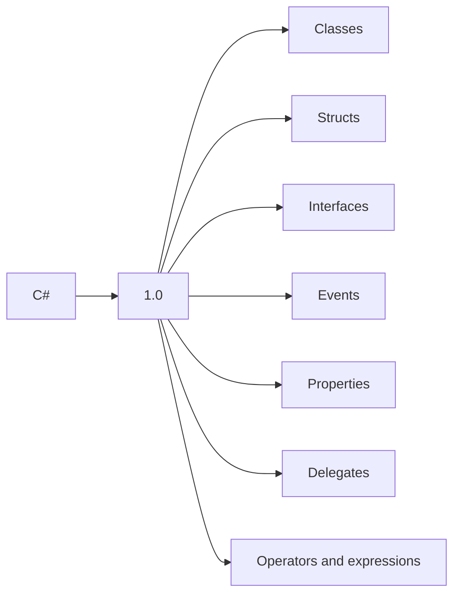
```mermaid
graph LR
C#-->1.0-->Classes
1.0-->Structs
1.0-->Interfaces
1.0-->Events
1.0-->Properties
1.0-->Delegates
1.0-->11[Operators and expressions]
```
### C# 1.2 2003.4 vs2003

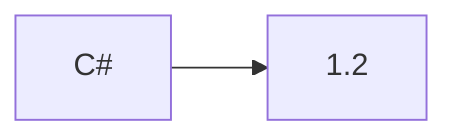
```mermaid
graph LR
C#-->1.2
```
### C# 2.0 2005.11 vs2005

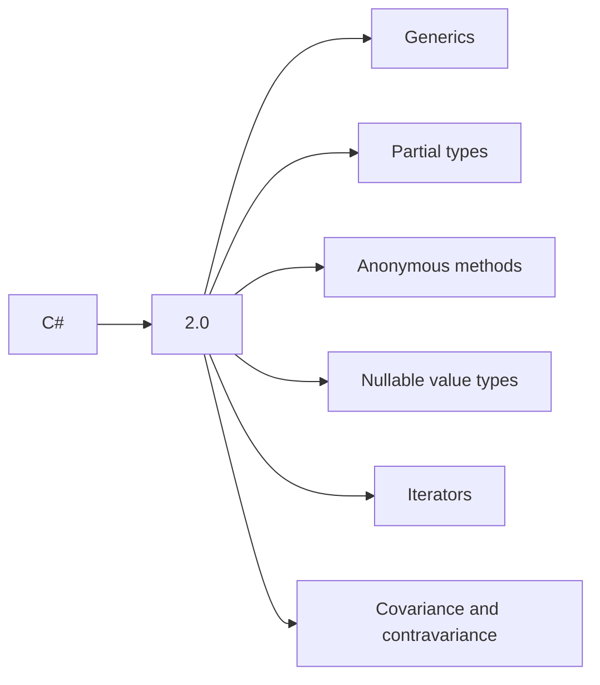
```mermaid
graph LR
C#-->2.0-->Generics
2.0-->21[Partial types]
2.0-->22[Anonymous methods]
2.0-->23[Nullable value types]
2.0-->Iterators
2.0-->24[Covariance and contravariance]
```

### C# 3.0 2007.11 vs2008

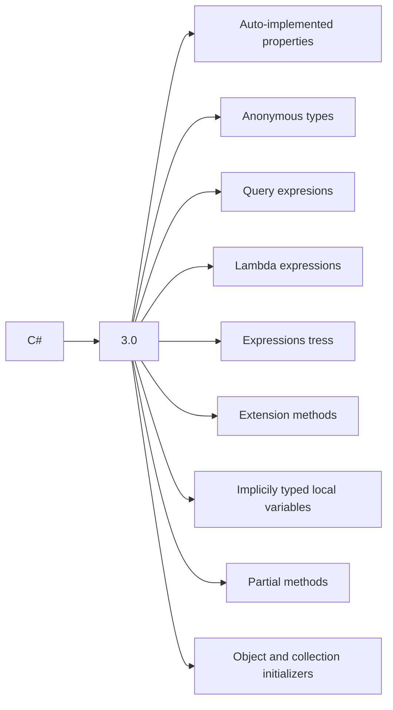
```mermaid
graph LR
C#-->3.0-->30[Auto-implemented properties]
3.0-->31[Anonymous types]
3.0-->32[Query expresions]
3.0-->33[Lambda expressions]
3.0-->34[Expressions tress]
3.0-->35[Extension methods]
3.0-->36[Implicily typed local variables]
3.0-->37[Partial methods]
3.0-->38[Object and collection initializers]
```

### C# 4.0 2010.4 vs2010

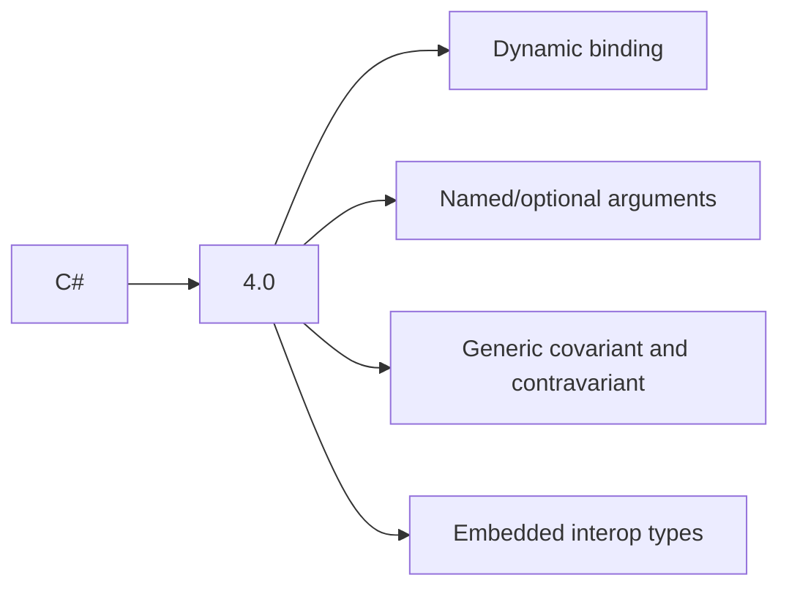
```mermaid
graph LR
C#-->4.0-->40[Dynamic binding]
4.0-->41[Named/optional arguments]
4.0-->427[Generic covariant and contravariant]
4.0-->43[Embedded interop types]
```

### C# 5.0 2012.8 vs2012

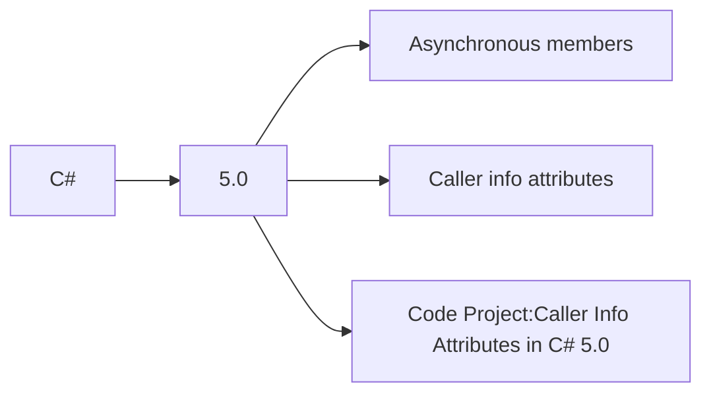
```mermaid
graph LR
C#-->5.0-->50[Asynchronous members]
5.0-->51[Caller info attributes]
5.0-->52[Code Project:Caller Info Attributes in C# 5.0]
```

### C# 6.0 2015.7 vs2015

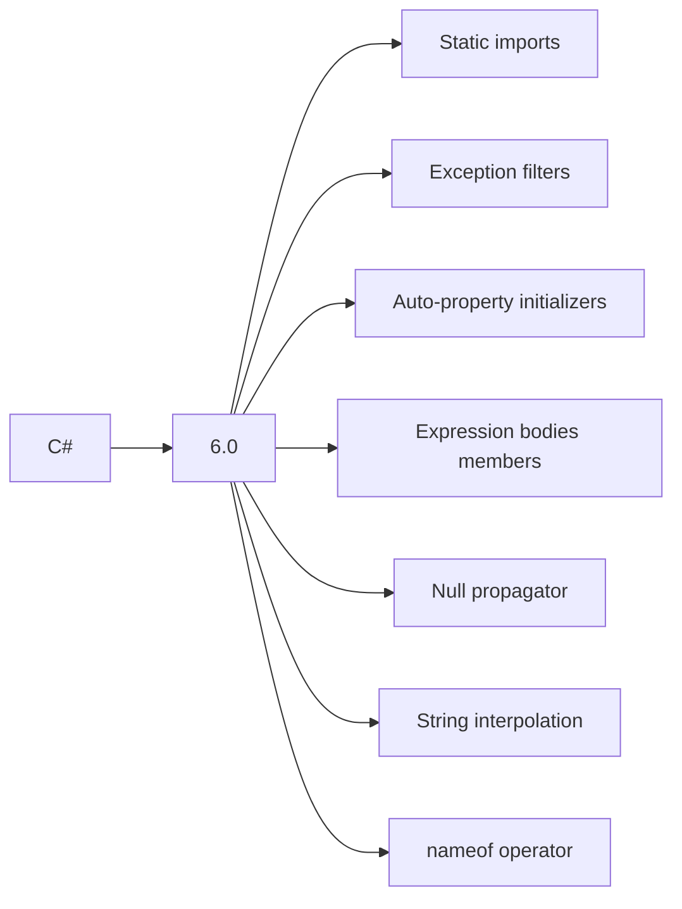
```mermaid
graph LR
C#-->6.0-->61[Static imports]
6.0-->62[Exception filters]
6.0-->63[Auto-property initializers]
6.0-->64[Expression bodies members]
6.0-->65[Null propagator]
6.0-->66[String interpolation]
6.0-->67[nameof operator]
```

### C# 7.0 2017.3 vs2017

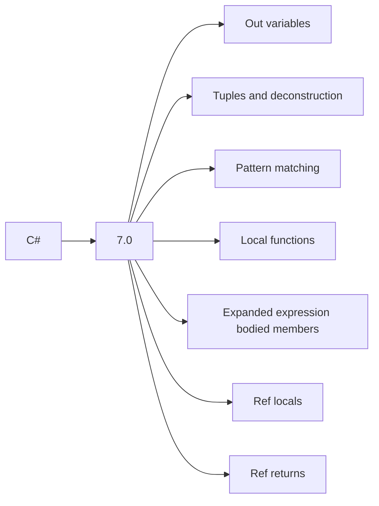
```mermaid
graph LR
C#-->7.0-->70[Out variables]
7.0-->71[Tuples and deconstruction]
7.0-->72[Pattern matching]
7.0-->73[Local functions]
7.0-->74[Expanded expression bodied members]
7.0-->75[Ref locals]
7.0-->76[Ref returns]
```

### C# 7.1 2017.8

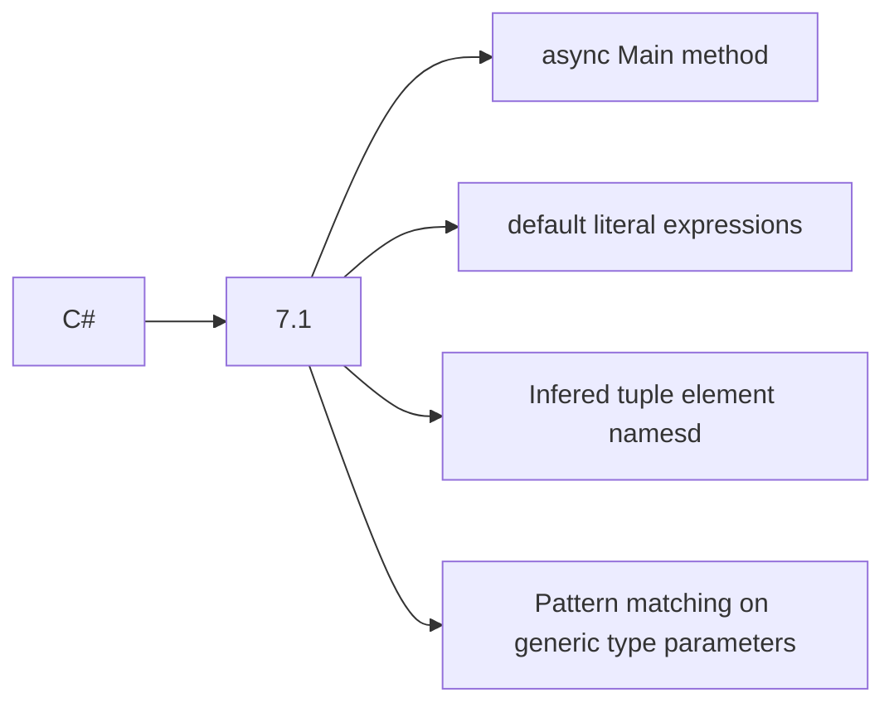
```mermaid
graph LR
C#-->7.1-->710[async Main method]
7.1-->711[default literal expressions]
7.1-->712[Infered tuple element namesd]
7.1-->713[Pattern matching on generic type parameters]
```

### C# 7.2 2017.11

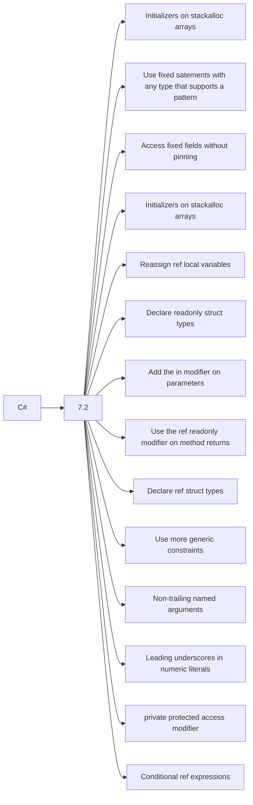
```mermaid
graph LR
C#-->7.2-->720[Initializers on stackalloc arrays]
7.2-->721[Use fixed satements with any type that supports a pattern]
7.2-->722[Access fixed fields without pinning]
7.2-->723[Initializers on stackalloc arrays]
7.2-->724[Reassign ref local variables]
7.2-->725[Declare readonly struct types]
7.2-->726[Add the in modifier on parameters]
7.2-->727[Use the ref readonly modifier on method returns]
7.2-->728[Declare ref struct types]
7.2-->729[Use more generic constraints]
7.2-->7210[Non-trailing named arguments]
7.2-->7211[Leading underscores in numeric literals]
7.2-->7212[private protected access modifier]
7.2-->7213[Conditional ref expressions]
```

### C# 7.3 2018.5

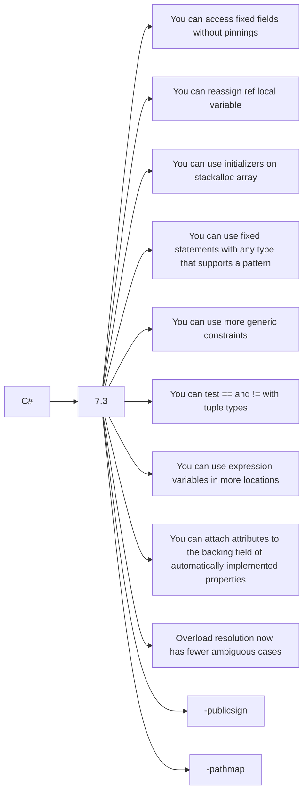
```mermaid
graph LR
C#-->7.3-->730[You can access fixed fields without pinnings]
7.3-->731[You can reassign ref local variable]
7.3-->732[You can use initializers on stackalloc array]
7.3-->733[You can use fixed statements with any type that supports a pattern]
7.3-->734[You can use more generic constraints]
7.3-->735[You can test == and != with tuple types]
7.3-->736[You can use expression variables in more locations]
7.3-->737[You can attach attributes to the backing field of automatically implemented properties]
7.3-->738[Overload resolution now has fewer ambiguous cases]
7.3-->739[-publicsign]
7.3-->7410[-pathmap]
```

### C# 8.0 2019.9 (.NET Core)

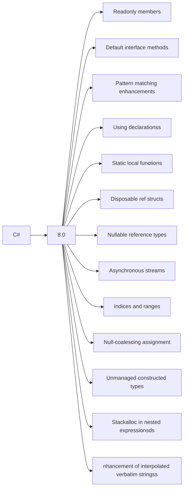
```mermaid
graph LR
C#-->8.0-->80[Readonly members]
8.0-->81[Default interface methods]
8.0-->82[Pattern matching enhancements]
8.0-->83[Using declarationss]
8.0-->84[Static local functions]
8.0-->85[Disposable ref structs]
8.0-->86[Nullable reference types]
8.0-->87[Asynchronous streams]
8.0-->88[Indices and ranges]
8.0-->89[Null-coalescing assignment]
8.0-->810[Unmanaged constructed types]
8.0-->811[Stackalloc in nested expressionsds]
8.0-->812[nhancement of interpolated verbatim stringss]
```

### C# 9 2020.11 (.NET 5) 

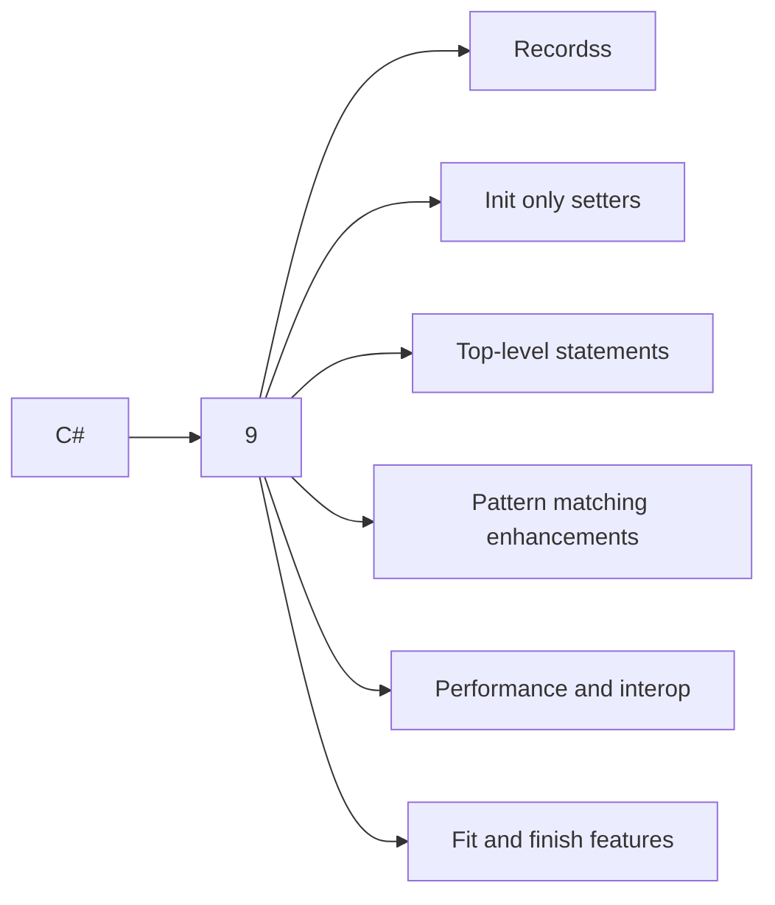
```mermaid
graph LR
C#-->9-->90[Recordss]
9-->91[Init only setters]
9-->92[Top-level statements]
9-->93[Pattern matching enhancements]
9-->94[Performance and interop]
9-->95[Fit and finish features]
```

### C# 10 2021.11

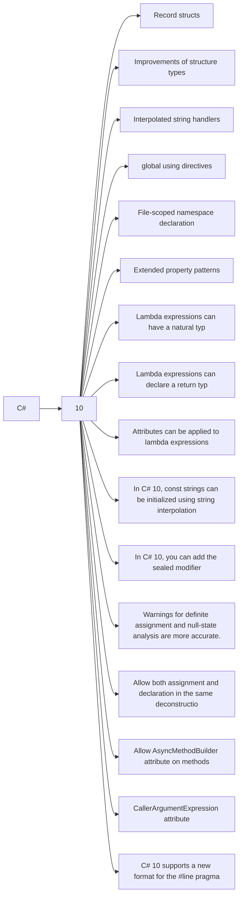
```mermaid
graph LR
C#-->10-->101[Record structs]
10-->102[Improvements of structure types]
10-->103[Interpolated string handlers]
10-->104[global using directives]
10-->105[File-scoped namespace declaration]
10-->106[Extended property patterns]
10-->107[Lambda expressions can have a natural typ]
10-->108[Lambda expressions can declare a return typ]
10-->109[Attributes can be applied to lambda expressions]
10-->1010[In C# 10, const strings can be initialized using string interpolation]
10-->1012[In C# 10, you can add the sealed modifier]
10-->1013[Warnings for definite assignment and null-state analysis are more accurate.]
10-->1014[Allow both assignment and declaration in the same deconstructio]
10-->1015[Allow AsyncMethodBuilder attribute on methods]
10-->1016[CallerArgumentExpression attribute]
10-->1017[C# 10 supports a new format for the #line pragma]
```

### C# 11 2022.11

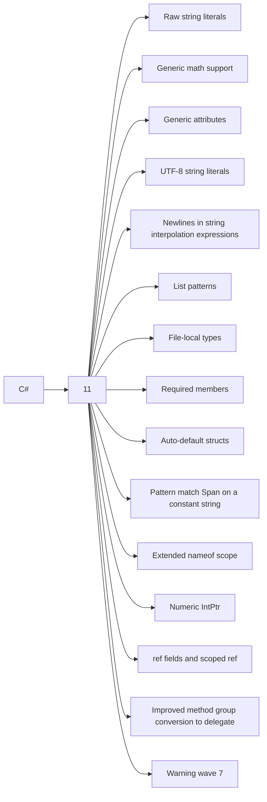
```mermaid
graph LR
C#-->11-->110[Raw string literals]
11-->111[Generic math support]
11-->112[Generic attributes]
11-->113[UTF-8 string literals]
11-->114[Newlines in string interpolation expressions]
11-->115[List patterns]
11-->116[File-local types]
11-->117[Required members]
11-->118[Auto-default structs]
11-->119[Pattern match Span<char> on a constant string]
11-->1110[Extended nameof scope]
11-->1111[Numeric IntPtr]
11-->1112[ref fields and scoped ref]
11-->1113[Improved method group conversion to delegate]
11-->1114[Warning wave 7]
```

### C# 12 2023.11

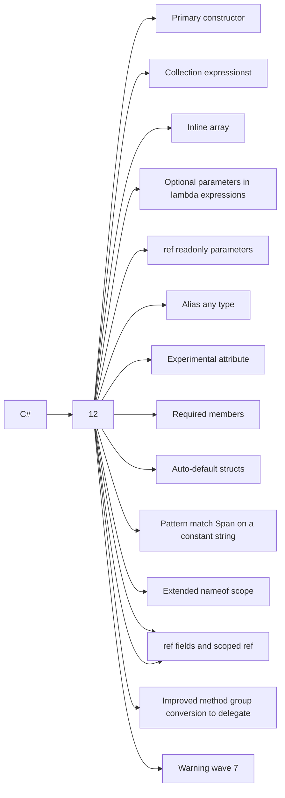
```mermaid
graph LR
C#-->12-->120[Primary constructor]
12-->121[Collection expressionst]
12-->122[Inline array]
12-->123[Optional parameters in lambda expressions]
12-->124[ref readonly parameters]
12-->125[Alias any type]
12-->126[Experimental attribute]
12-->127[Required members]
12-->128[Auto-default structs]
12-->129[Pattern match Span<char> on a constant string]
12-->1210[Extended nameof scope]
12-->1212[Numeric IntPtr]
12-->1212[ref fields and scoped ref]
12-->1213[Improved method group conversion to delegate]
12-->1214[Warning wave 7]
```

### C# 13 2024.11

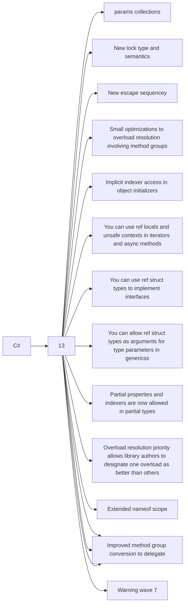
```mermaid
graph LR
C#-->13-->130[params collections]
13-->131[New lock type and semantics]
13-->132[New escape sequencey]
13-->133[Small optimizations to overload resolution involving method groups]
13-->134[Implicit indexer access in object initializers]
13-->135[You can use ref locals and unsafe contexts in iterators and async methods]
13-->136[You can use ref struct types to implement interfaces]
13-->137[You can allow ref struct types as arguments for type parameters in genericss]
13-->138[Partial properties and indexers are now allowed in partial types]
13-->139[Overload resolution priority allows library authors to designate one overload as better than others]
13-->1310[Extended nameof scope]
13-->1313[Numeric IntPtr]
13-->1313[ref fields and scoped ref]
13-->1313[Improved method group conversion to delegate]
13-->1314[Warning wave 7]
```

## 类型

### 分类

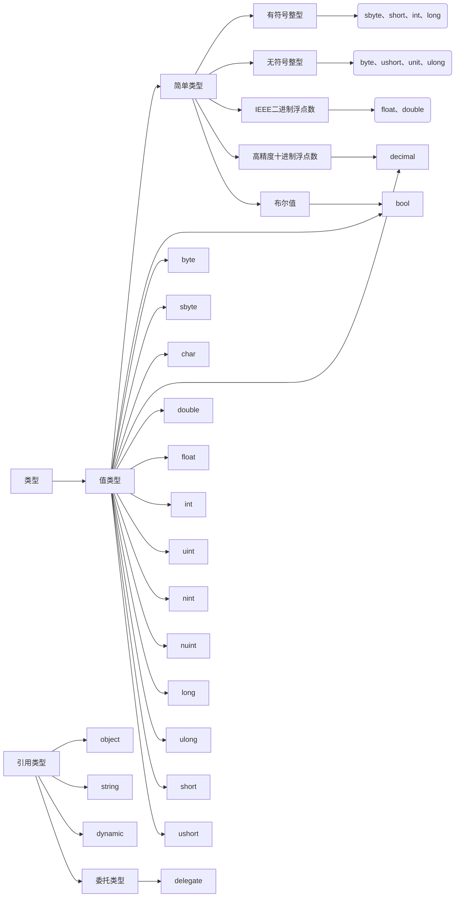
```mermaid
graph LR
类型-->值类型
值类型-->简单类型
简单类型-->有符号整型-->v1(sbyte、short、int、long)
简单类型-->无符号整型-->v2(byte、ushort、unit、ulong)
简单类型-->IEEE二进制浮点数-->v3(float、double)
简单类型-->高精度十进制浮点数-->decimal
简单类型-->布尔值-->bool
值类型-->bool
值类型-->byte
值类型-->sbyte
值类型-->char
值类型-->decimal
值类型-->double
值类型-->float
值类型-->int
值类型-->uint
值类型-->nint
值类型-->nuint
值类型-->long
值类型-->ulong
值类型-->short
值类型-->ushort
引用类型-->object
引用类型-->string
引用类型-->dynamic
引用类型-->委托类型-->delegate
```

### 内置类型

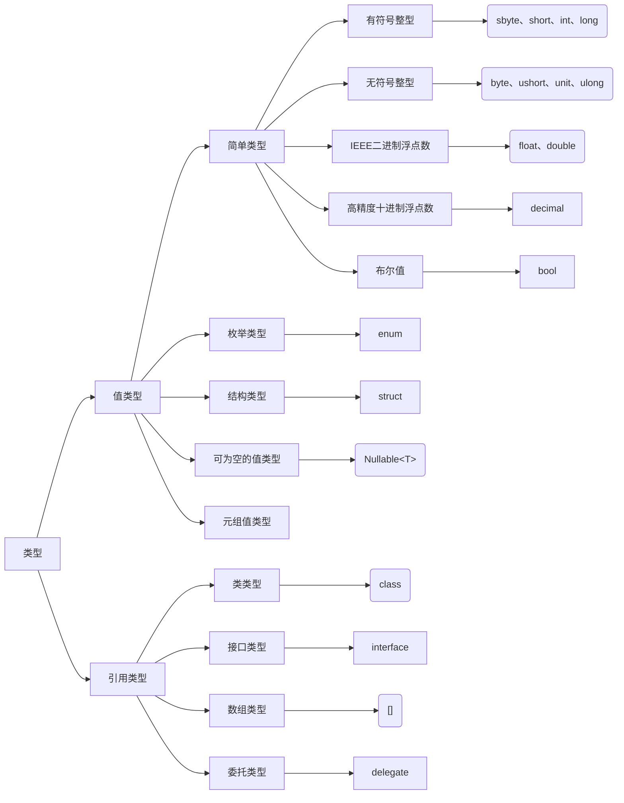
```mermaid
graph LR
类型-->值类型
值类型-->简单类型
简单类型-->有符号整型-->v1(sbyte、short、int、long)
简单类型-->无符号整型-->v2(byte、ushort、unit、ulong)
简单类型-->IEEE二进制浮点数-->v3(float、double)
简单类型-->高精度十进制浮点数-->decimal
简单类型-->布尔值-->bool
值类型-->枚举类型-->enum
值类型-->结构类型-->struct
值类型-->可为空的值类型-->v4(Nullable&lt;T&gt;)
值类型-->元组值类型
类型-->引用类型
引用类型-->类类型-->v5("class")
引用类型-->接口类型-->interface
引用类型-->数组类型-->v6("[]")
引用类型-->委托类型-->delegate
```

## 成员

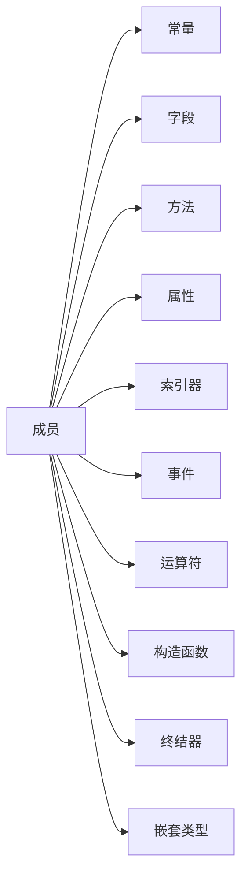
```mermaid
graph LR
成员-->常量
成员-->字段
成员-->方法
成员-->属性
成员-->索引器
成员-->事件
成员-->运算符
成员-->构造函数
成员-->终结器
成员-->嵌套类型
```

## 可访问性

```mermaid
graph LR
可访问性-->public
可访问性-->private
可访问性-->protected
可访问性-->internal
可访问性-->x(protected internal)
可访问性-->x(private protected)
```
