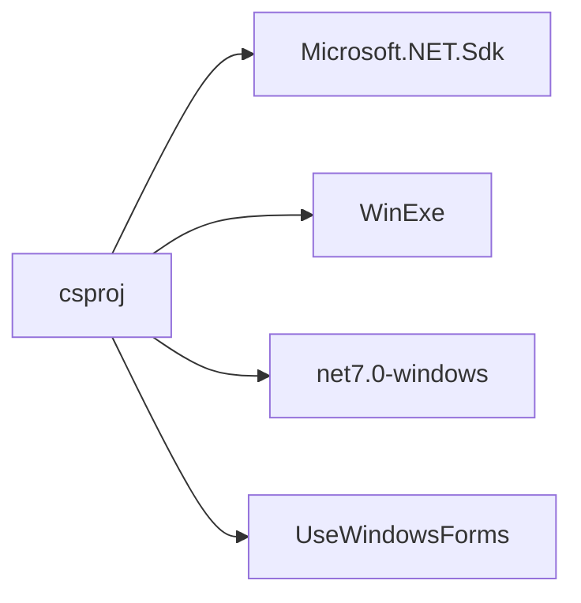
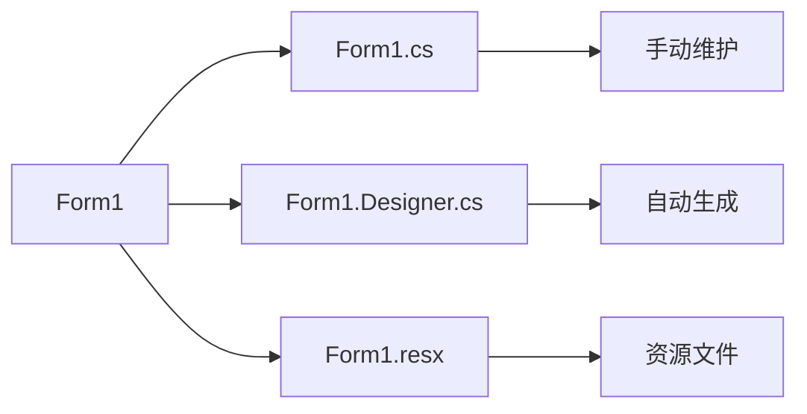
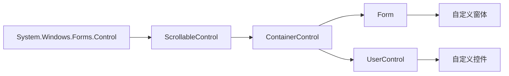
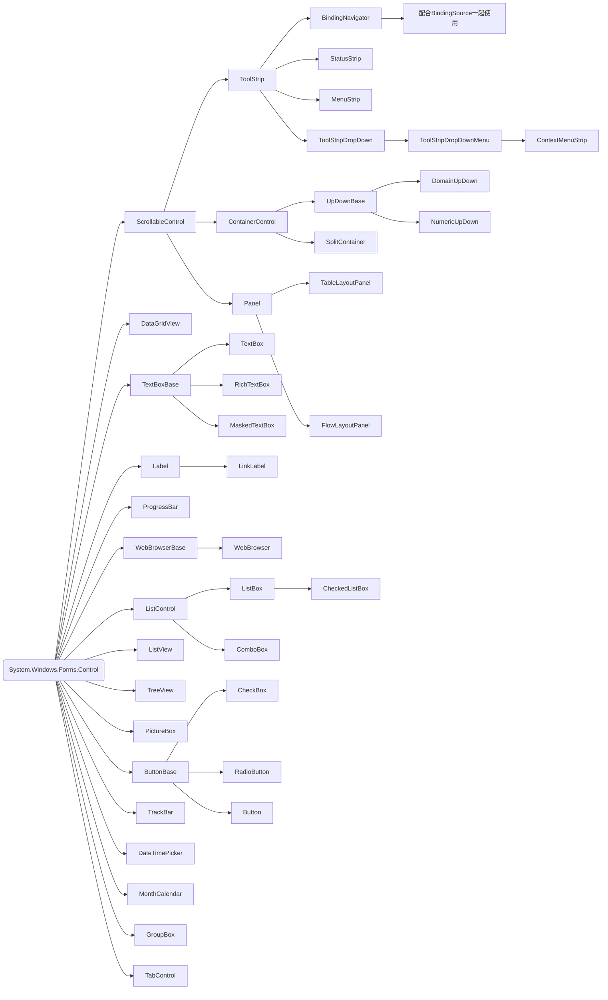
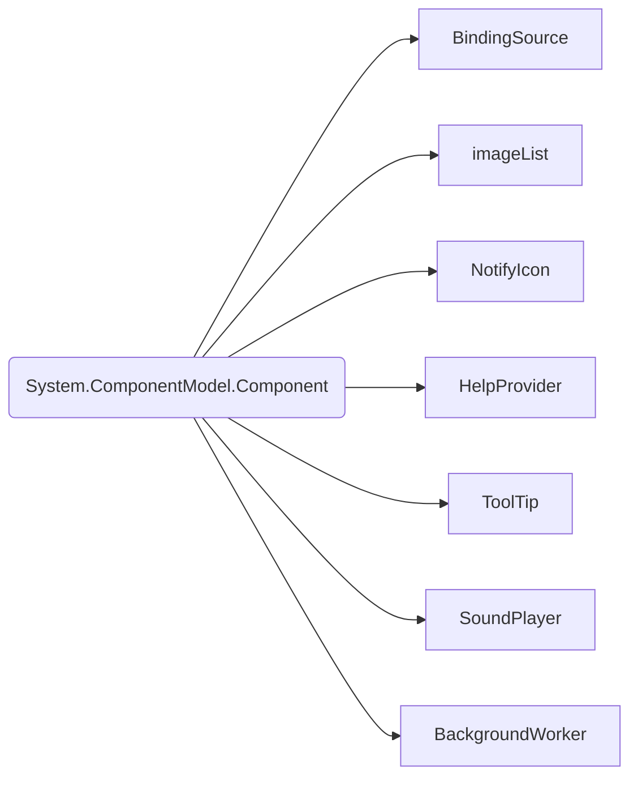
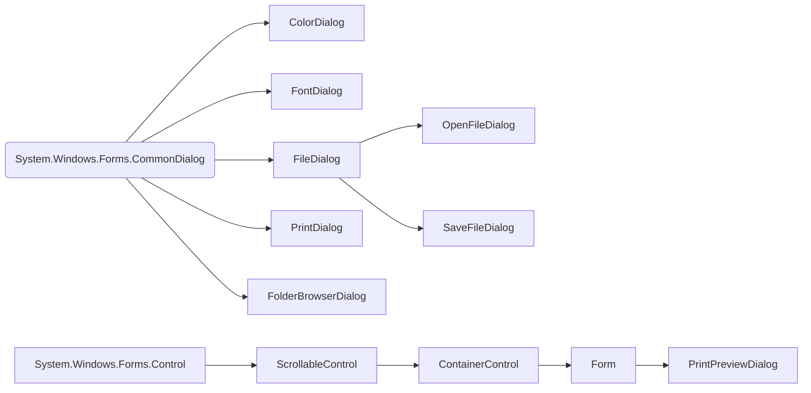

# winform

<https://github.com/dotnet/winforms>

1. 项目配置
1. UI 组成
1. 窗体设计
    1. 自定义窗体和控件
1. 内置控件、组件和对话框
    1. 内置控件
    1. 内置组件
    1. 内置对话框

## 一、项目配置

## 二、UI 组成

由多个继承自 System.Windows.Forms.Form 的窗体组成,每个窗体包含多个继承自 System.Windows.Forms.Control 的控件

## 三、窗体设计

## 四、 控件、组件和对话框

### 1. 自定义窗体和控件

### 2. 内置控件

### 4. 内置组件

### 3. 内置对话框

