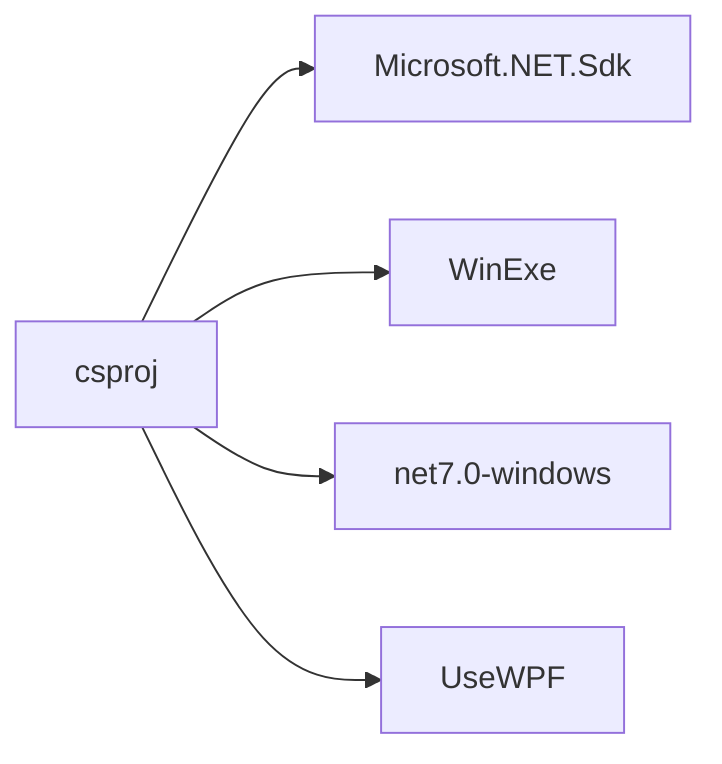
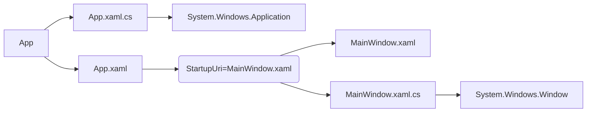
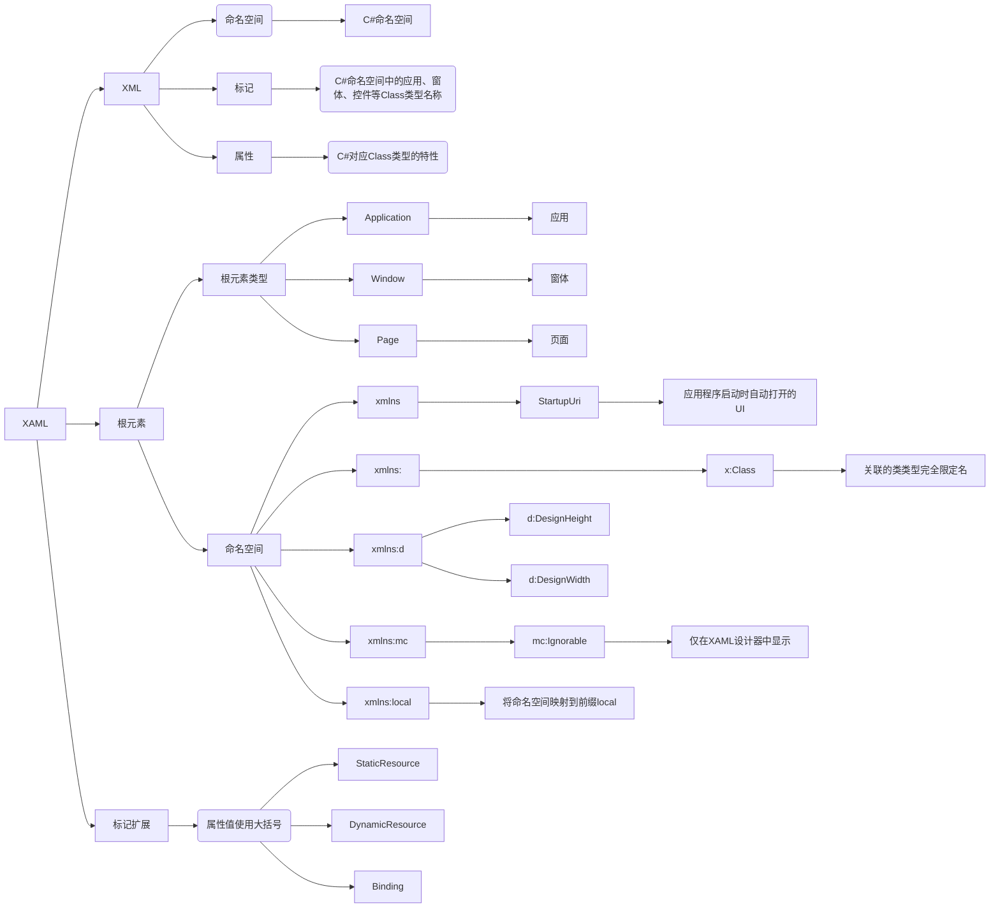
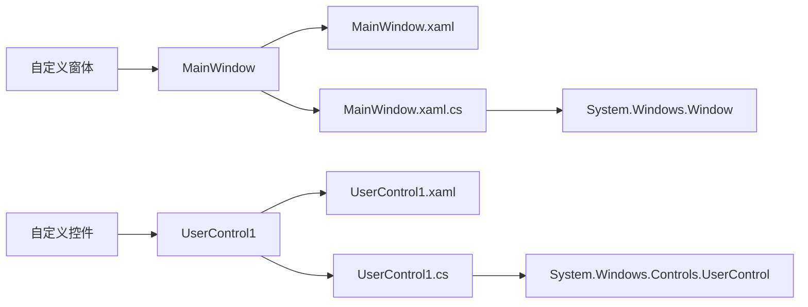
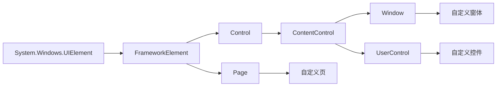

# WPF

<https://github.com/microsoft/WPF-Samples>

1. 项目配置
1. UI 组成
1. 窗体设计
    1. 自定义窗体和控件
1. 内置控件、组件和对话框
    1. 内置控件
    1. 内置组件
    1. 内置对话框

## 一、项目配置

## 二、UI 组成

由多个继承自 System.Windows.Window 的窗体组成,每个窗体包含多个继承自 System.Windows.UIElement 的 WPF 控件;使用 xaml 描述界面

### XAML

[标记扩展](https://learn.microsoft.com/zh-cn/dotnet/desktop/wpf/advanced/wpf-xaml-extensions?view=netframeworkdesktop-4.8&viewFallbackFrom=netdesktop-7.0)

## 三、窗体设计

### 自定义窗体和控件

### 布局

## 四、 控件、组件和对话框

### 1. 自定义窗体和控件

### 内置控件
