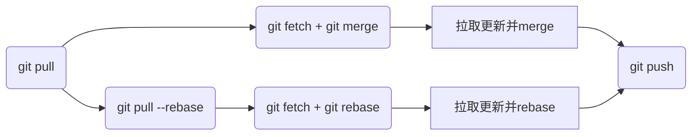

# Git 基础

<https://git-scm.com/book/zh/v2>


```mermaid
flowchart LR
git(git pull) --> fetch(git fetch + git merge)-->拉取更新并merge-->push(git push)
git-->pull2(git pull --rebase) --> rebase(git fetch + git rebase)-->拉取更新并rebase-->push(git push)
```

## 常用命令

```bash
git pull --rebase
```

```bash
git merge --no-ff
```

```bash
git merge --squash
```
