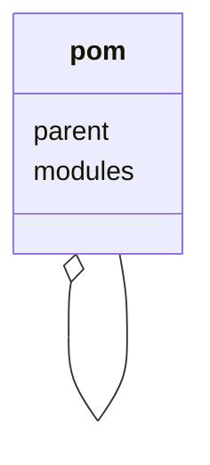

# Maven



<https://maven.apache.org/>

1. ~/.m2
    1. settings.xml
    2. repository
2. .mvn
    1. maven.config
    2. jvm.config
    3. extensions.xml
3. pom.xml
4. 项目结构

## ~/.m2

本地配置文件:`~/.m2/settings.xml`
本地仓库位置:`~/.m2/repository`

## .mvn

## pom.xml

<https://maven.apache.org/pom.html>

```xml
<project xmlns="http://maven.apache.org/POM/4.0.0" xmlns:xsi="http://www.w3.org/2001/XMLSchema-instance"
  xsi:schemaLocation="http://maven.apache.org/POM/4.0.0 https://maven.apache.org/xsd/maven-4.0.0.xsd">
  <modelVersion>4.0.0</modelVersion>

  <!-- The Basics -->
  <groupId>机构</groupId>
  <artifactId>项目</artifactId>
  <version>版本</version>
  <packaging>jar或war</packaging>
  <dependencies>
    <dependency>
      <groupId>...</groupId>
      <artifactId>...</artifactId>
      <version>...</version>
      <type>...</type>
      <scope>...</scope>
      <optional>...</optional>
    </dependency>
  </dependencies>
  <parent>
      <groupId>...</groupId>
      <artifactId>...</artifactId>
      <version>...</version>
      <relativePath>../my-parent</relativePath>
  </parent>
  <dependencyManagement>...</dependencyManagement>
  <modules>
    <module>my-project</module>
    <module>another-project</module>
    <module>third-project/pom-example.xml</module>
  </modules>
  <properties>...</properties>

  <!-- Build Settings -->
  <build>...</build>
  <reporting>...</reporting>

  <!-- More Project Information -->
  <name>...</name>
  <description>...</description>
  <url>...</url>
  <inceptionYear>...</inceptionYear>
  <licenses>...</licenses>
  <organization>...</organization>
  <developers>...</developers>
  <contributors>...</contributors>

  <!-- Environment Settings -->
  <issueManagement>...</issueManagement>
  <ciManagement>...</ciManagement>
  <mailingLists>...</mailingLists>
  <scm>...</scm>
  <prerequisites>...</prerequisites>
  <repositories>
    <repository>
      <id>...</id>
      <name>...</name>
      <url>...</url>
      <layout>...</layout>
      <snapshots>
        <enabled>...</enabled>
      </snapshots>
    </repository>
  </repositories>
  <pluginRepositories>...</pluginRepositories>
  <distributionManagement>...</distributionManagement>
  <profiles>...</profiles>
</project>
```

## 项目结构

<https://maven.apache.org/guides/introduction/introduction-to-the-standard-directory-layout.html>

```txt
├── pom.xml                         # Maven 项目文件
├── src                             # 源代码
|   ├── main                        # 主目录
|   |   ├── java                    # java 源码
|   |   ├── resources               # 资源文件
|   |   ├── filters                 # 资源过滤器
|   |   └── webapp                  # Web 应用源码
|   ├── test                        # 测试目录
|   |   ├── java                    # java 源码
|   |   ├── resources               # 资源文件
|   |   └── filters                 # 资源过滤器
|   ├── it                          # 集成测试目录
|   ├── assembly                    # 程序集描述
|   └── site                        # 网站
├── LICENSE.txt                     # 版权
├── NOTICE.txt                      # 项目依赖声明
└── README.txt                      # 项目介绍
```
