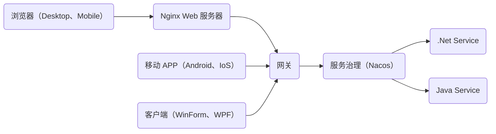
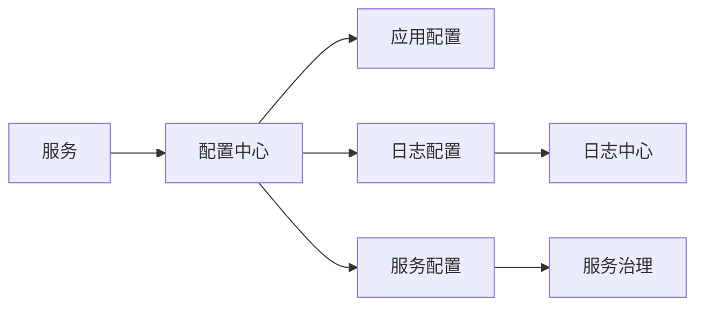

# 微服务架构

## 请求路线

```mermaid
graph LR
Browser(浏览器（Desktop、Mobile）)-->Nginx(Nginx Web 服务器)-->Gateway(网关)
APP(移动 APP（Android、IoS）)-->Gateway
客户端(客户端（WinForm、WPF）)-->Gateway
Gateway-->服务治理(服务治理（Nacos）)
服务治理-->dotnet(.Net Service)
服务治理-->java(Java Service)
```

## 配置中心

```mermaid
graph LR
服务-->配置中心
配置中心-->应用配置
配置中心-->日志配置-->日志中心
配置中心-->服务配置-->服务治理
```
