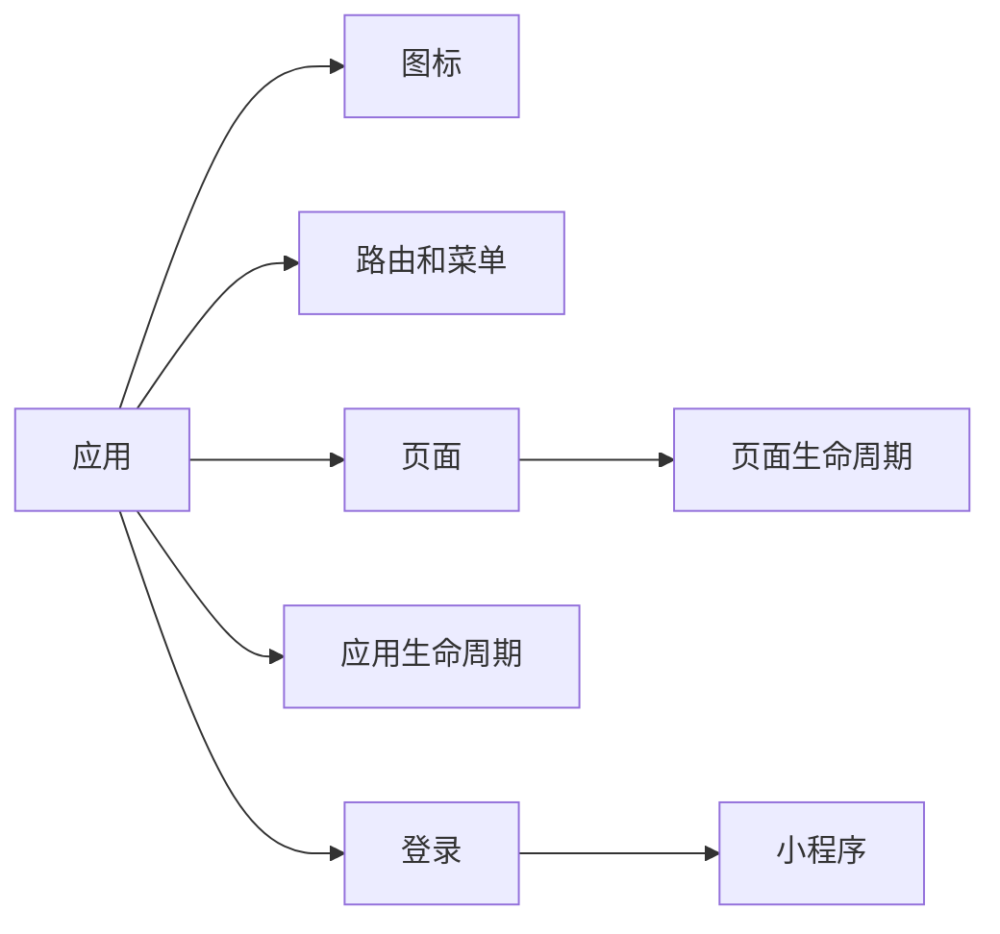
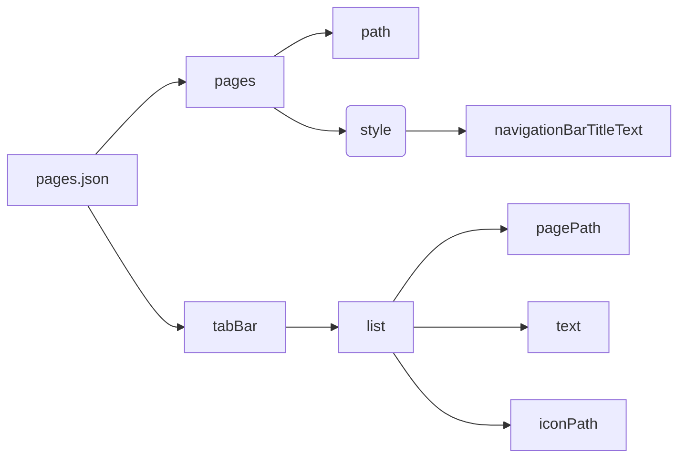
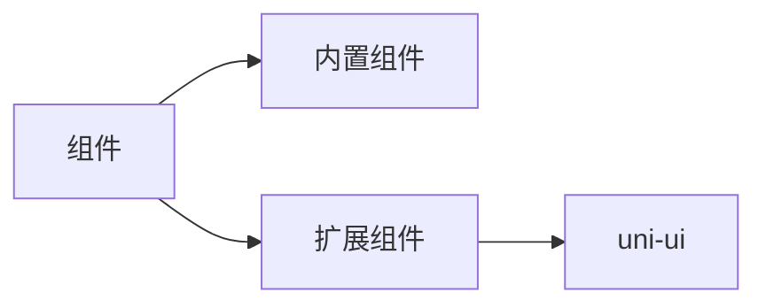
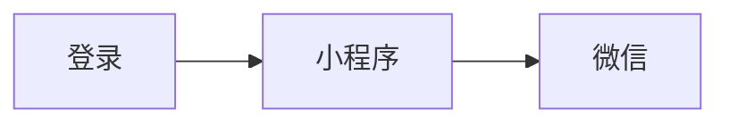

# uniapp



1. [目录结构](https://uniapp.dcloud.net.cn/tutorial/project.html)
    1. static：静态资源
    1. pages：页面
    1. pages.json：页面路由
    1. main.js：vue 入口文件
    1. App.vue：App 根组件
    1. uni.scss：uni 内置的常用样式变量
    1. menifest.json：应用配置文件
        1. AndroidManifest.xml
        1. Info.plist

## 图标配置

manifest.json 配置

## 路由和菜单

结构：



示例：

```json
{
 "pages": [ //pages数组中第一项表示应用启动页，参考：https://uniapp.dcloud.io/collocation/pages
  {
   "path": "pages/home/home",
   "style": {
    "navigationBarTitleText": "首页"
   }
  },
  {
   "path": "pages/catelog/catelog",
   "style": {
    "navigationBarTitleText": "分类"
   }
  },
  {
   "path": "pages/cart/cart",
   "style": {
    "navigationBarTitleText": "购物车"
   }
  },
  {
   "path": "pages/user/user",
   "style": {
    "navigationBarTitleText": "我的"
   }
  }
 ],
 "globalStyle": {
  "navigationBarTextStyle": "black",
  "navigationBarTitleText": "微小记事本",
  "navigationBarBackgroundColor": "#F8F8F8",
  "backgroundColor": "#F8F8F8"
 },
 "uniIdRouter": {},
 "tabBar": {
  "list": [{
    "pagePath": "pages/home/home",
    "text": "首页",
    "iconPath": "/static/images/tabbar/home.png",
    "selectedIconPath": "/static/images/tabbar/home.png"
   },
   {
    "pagePath": "pages/catelog/catelog",
    "text": "分类",
    "iconPath": "/static/images/tabbar/catelog.png",
    "selectedIconPath": "/static/images/tabbar/catelog.png"
   },
   {
    "pagePath": "pages/cart/cart",
    "text": "购物车",
    "iconPath": "/static/images/tabbar/cart.png",
    "selectedIconPath": "/static/images/tabbar/cart.png"
   },
   {
    "pagePath": "pages/user/user",
    "text": "我的",
    "iconPath": "/static/images/tabbar/user.png",
    "selectedIconPath": "/static/images/tabbar/user.png"
   }
  ]
 }
}
```

## 页面



## 登录



## 连接

1. [uniapp 登录](https://uniapp.dcloud.net.cn/api/plugins/login.html#login)
1. [微信小程序登录](https://developers.weixin.qq.com/miniprogram/dev/framework/open-ability/login.html)
