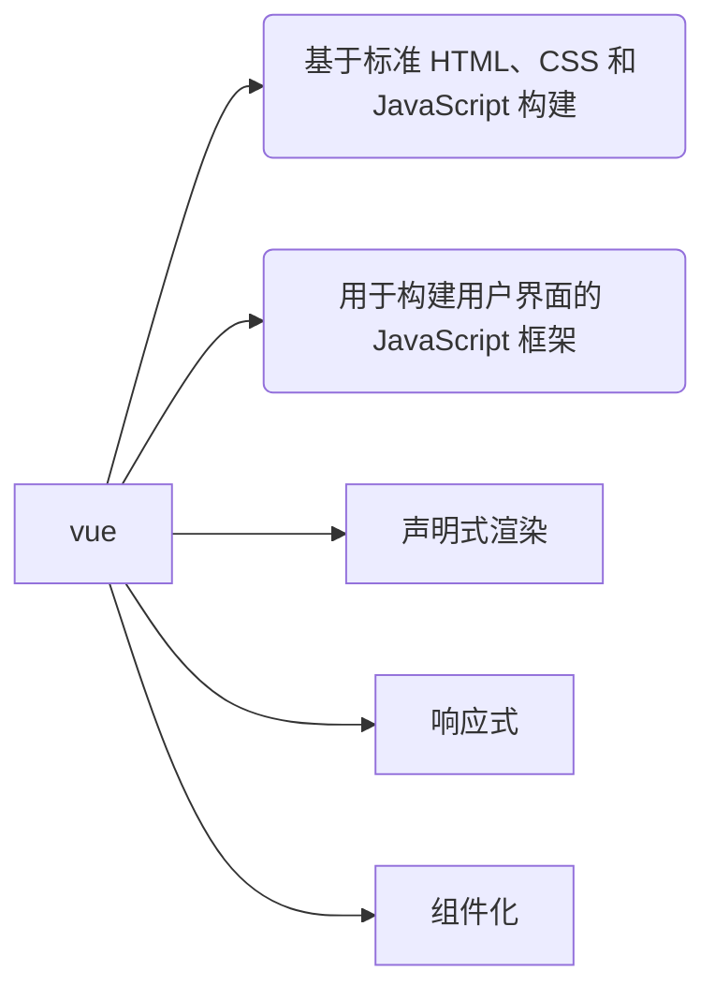
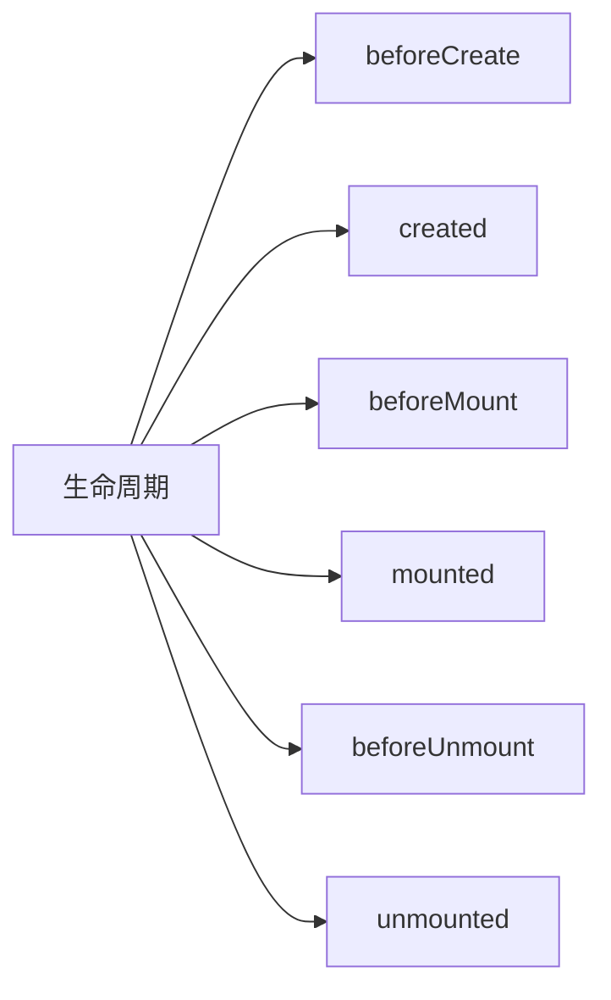
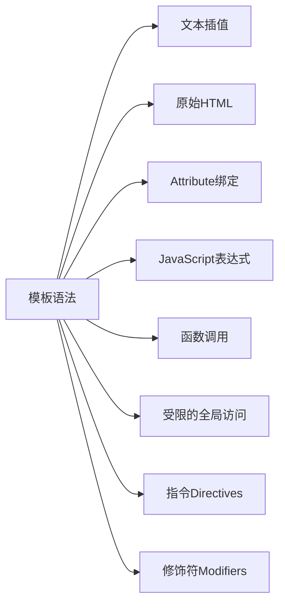
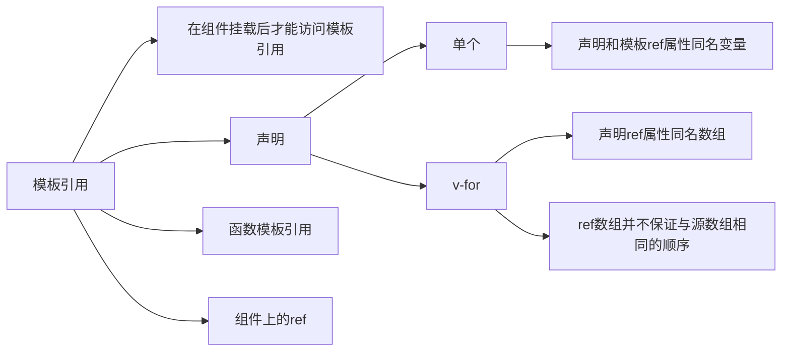
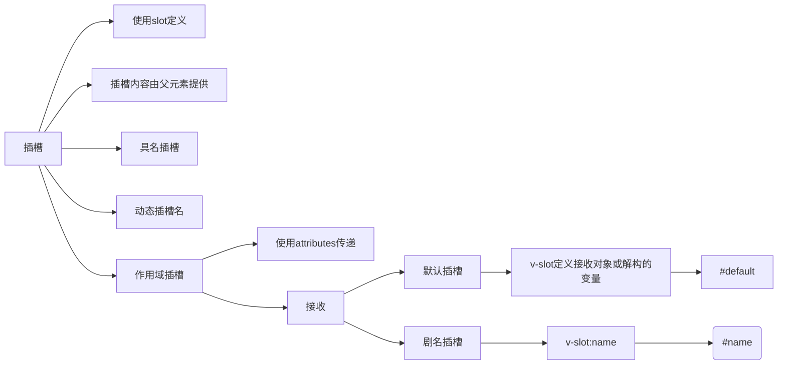
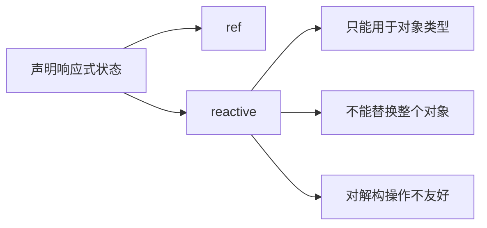
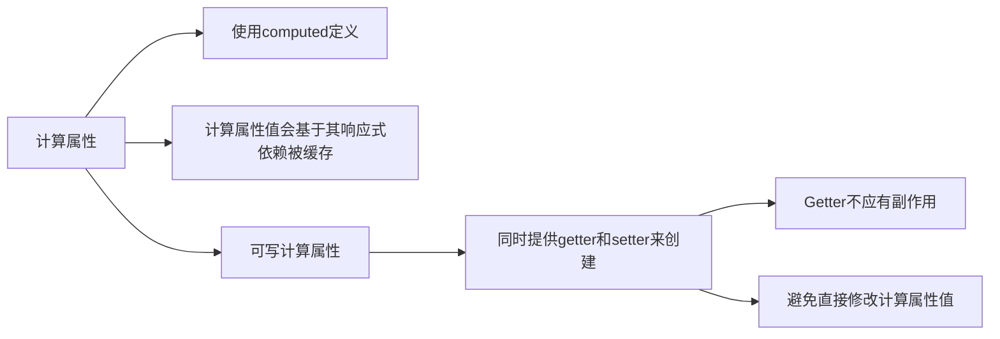
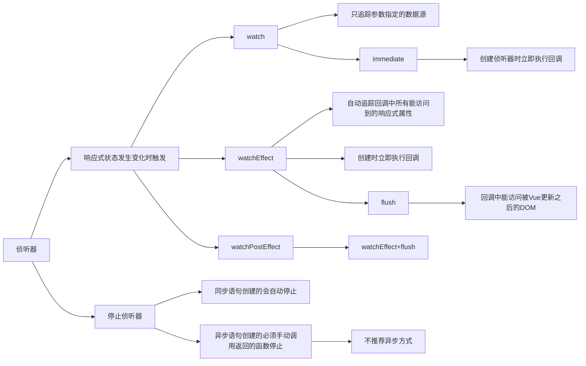
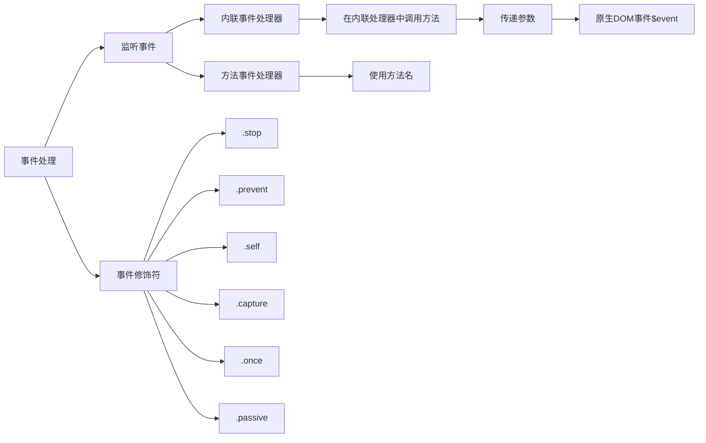

# vue

<https://cn.vuejs.org/>

1. 组件
    1. 生命周期
    1. ESM组件
    1. SFC组件
1. 模板
    1. 基础语法 
1. 响应式



## 组件

ESM 组件可以直接使用，单文件组件（SFC）必须构建

### 生命周期



### ESM 组件

```js
import { ref } from 'vue';

export default {
    components:{},
    template: `<p class="greeting">{{ greeting }}</p>`,
    props:[],
    emit:[]
    setup(props,context){
        const greeting = ref('Hello World!');
        return {
            greeting
        };
    }
}
```

### 单文件组件

```html
<script setup>
    import { ref } from "vue";
    const greeting = ref("Hello World!");
</script>

<template>
    <p class="greeting">{{ greeting }}</p>
</template>

<style>
    .greeting {
        color: red;
        font-weight: bold;
    }
</style>
```

## 模板

### 语法



### 模板引用



### 插槽



## 响应式

推荐使用 ref() 函数来声明响应式状态









